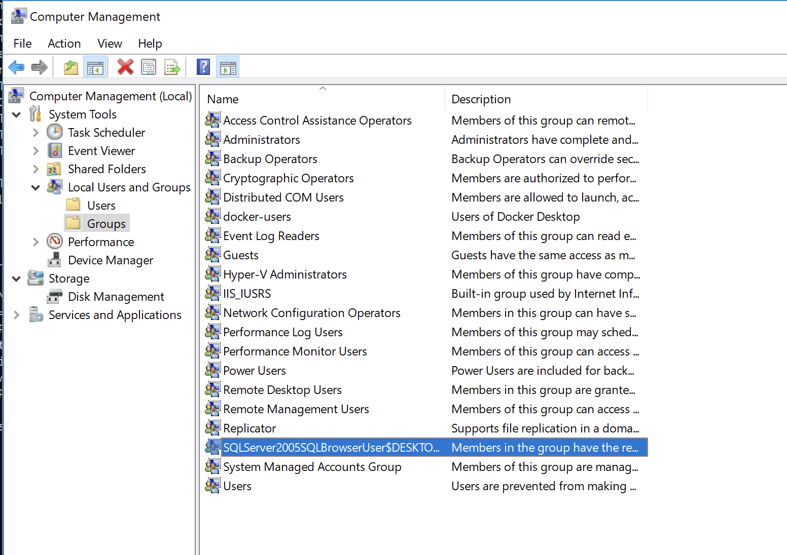

# Lab 3: Computer Architecture: Users, files, processes

Date: 12/05/2021 Author: David Glance

### Learning Objectives

1. Explore various aspects of computer architecture such as processes, file systems, users and access control

### Technologies Covered

* Windows, MacOS, Linux
* Bash, PowerShell, Command Prompt

### Command Line

Operating systems offer a number of different ways of interacting with files, processes and other aspects of the system through the use of commands typed in a terminal window. These commands can even be added to files and run as scripts to perform more complicated actions.

On Windows, there is a program called the Command Prompt as well as a program called PowerShell, whilst on the Mac and Linux there is the Terminal program that runs various types of "shell" programs. Many of the commands in these systems are similar and so _**pwd**_ \(print working directory\) will print the current directory 

We are going to stick with Bash which runs on Windows \(WSL\), Mac OS and Linux. To do this, run the command \(Apple Silicon: docker run -it cybernemosyne/cits1003:bash-x\):

```bash
$ docker run -it cybernemosyne/cits1003:bash
root@86eba39a9594:/# pwd
/
```

The pwd command shows that we are in the root directory and when we list the contents of that directory using the **ls -al** command, we will get:

```bash
root@86eba39a9594:/# ls -al
total 60
drwxr-xr-x   1 root root 4096 Jul 13 05:58 .
drwxr-xr-x   1 root root 4096 Jul 13 05:58 ..
-rwxr-xr-x   1 root root    0 Jul 13 05:58 .dockerenv
lrwxrwxrwx   1 root root    7 Jun  9 07:27 bin -> usr/bin
drwxr-xr-x   2 root root 4096 Apr 15  2020 boot
drwxr-xr-x   5 root root  360 Jul 13 05:58 dev
drwxr-xr-x   1 root root 4096 Jul 13 05:58 etc
drwxr-xr-x   2 root root 4096 Apr 15  2020 home
lrwxrwxrwx   1 root root    7 Jun  9 07:27 lib -> usr/lib
lrwxrwxrwx   1 root root    9 Jun  9 07:27 lib32 -> usr/lib32
lrwxrwxrwx   1 root root    9 Jun  9 07:27 lib64 -> usr/lib64
lrwxrwxrwx   1 root root   10 Jun  9 07:27 libx32 -> usr/libx32
drwxr-xr-x   2 root root 4096 Jun  9 07:27 media
drwxr-xr-x   2 root root 4096 Jun  9 07:27 mnt
drwxr-xr-x   2 root root 4096 Jun  9 07:27 opt
dr-xr-xr-x 222 root root    0 Jul 13 05:58 proc
drwx------   2 root root 4096 Jun  9 07:31 root
drwxr-xr-x   5 root root 4096 Jun  9 07:31 run
lrwxrwxrwx   1 root root    8 Jun  9 07:27 sbin -> usr/sbin
drwxr-xr-x   2 root root 4096 Jun  9 07:27 srv
dr-xr-xr-x  13 root root    0 Jul 13 05:58 sys
drwxrwxrwt   1 root root 4096 Jul 13 05:54 tmp
drwxr-xr-x  13 root root 4096 Jun  9 07:27 usr
drwxr-xr-x   1 root root 4096 Jun  9 07:31 var
```

All operating systems have file systems that operate on the basis of a hierarchy of directories or folders. We used the ls command to list the contents of the root directory /. The flags \(arguments\) -al passed to the ls command means list all the contents and in a long version. The layout here is a typical format of a Linux file system. We will go throughwhat some of these directories are for but in summary:

**/** is the root directory and only the user root has access to write in this directory. The user root's home directory is /root.

**/bin** contains user binary executables like ps, ls, ping, grep etc. it is a symbolic link to **/usr/bin**

**/sbin** contains system binaries like iptables, reboot, fdisk, ifconfig, etc.

**/etc** contains configuration files and scripts for services running on the system. Also contains the passwd and shadow files that contain user and password information.

**/dev** contains device files that are the interface with physical devices on, or attached to, the system such as tty devices /dev/tty1. 

**/proc** contains files that store information about system processes like uptime for example.

**/var** contains files like logs \(/var/logs\), backups \(/var/backups\), mail \(/var/mail\) and spool \(printing; /var/spool\). There is also a /var/tmp directory that can be used to run programs out of. This directory does survive reboots however. The directory /var/www/html is often used as the root directory of the web server.

**/tmp** contains temporary files as mentioned previously. Files get deleted on reboot.

**/usr** contains user binaries, libraries, documentation and source code

**/usr/local** contains users programs that you install from source.

**/home** contains user home directories

**/boot** contains boot loader files

**/lib** contains system libraries

**/opt** contains optional add-on applications

**/mnt** is a location for mounting temporary filesystems

**/media** is a location for mounting removable media devices like CDs

**/srv** contains specific service related data

Users have a _**home directory**_ which in Windows is usually located in c:\Users, on the Mac it is /Users and on Linux it is in /home. On this container, it will be empty because we only have one user, root, whose home directory is /root

Navigating around can be done using the **cd** \(change directory\) command with an argument that tells cd which directory you want to move to. Two special shortcuts are the "." \(single dot\) and ".." \(double dot\) that specify the current directory and the parent directory respectively.

```bash
root@86eba39a9594:/# cd /home
root@86eba39a9594:/home# cd ..
root@86eba39a9594:/# 
```


#### Creating, deleting, copying and moving a file

```bash
root@86eba39a9594:/# cd /root
root@86eba39a9594:~# touch file.txt
root@86eba39a9594:~# ls
file.txt
root@86eba39a9594:~# cp file.txt file2.txt
root@86eba39a9594:~# ls
file.txt  file2.txt
root@86eba39a9594:~# rm file2.txt
root@86eba39a9594:~# mv file.txt file2.txt
root@86eba39a9594:~# ls
file2.txt
root@86eba39a9594:~# rm file2.txt
```


If you ever want help with a command, you can type _**help &lt;command&gt;**_ on Windows or _**man &lt;command&gt;**_ on Linux or Mac.


#### Finding files

Linux has a find command that can be used for finding files. The basic syntax is:

> _**find &lt;starting directory&gt; -name &lt;file to find&gt;**_

find will look in all sub-directories and report on any files that match the name provided

```bash
root@86eba39a9594:~# find / -name ls
/usr/bin/ls
```

We can use wildcard characters as follows:

```bash
root@86eba39a9594:~# find / -name host*
/var/lib/dpkg/info/hostname.list
/var/lib/dpkg/info/hostname.md5sums
/etc/host.conf
/etc/hosts
/etc/hostname
/proc/sys/kernel/hostname
/usr/share/doc/hostname
/usr/bin/hostid
/usr/bin/hostname
```

### Hidden Files and other Attributes

In Linux, files that start with a period \(.\) are hidden from the directory listing command ls. To see them, you need to use the -a flag:

```bash
root@86eba39a9594:~# ls  
root@86eba39a9594:~# ls -al
total 16
drwx------ 1 root root 4096 Jul 13 07:53 .
drwxr-xr-x 1 root root 4096 Jul 13 05:58 ..
-rw-r--r-- 1 root root 3106 Dec  5  2019 .bashrc
-rw-r--r-- 1 root root  161 Dec  5  2019 .profile

```

Linux has a limited set of specific attributes on a file that control how the file is accessed. One attribute for example is the Append Only attribute that only allows write operations on the file to append to it and not overwrite any existing content. Another attribute is Immutable which does not allow the file contents or metadata to change at all. You can list and change attributes on Linux using lsattr and chattr programs

### Downloading Files 

### Question 1: Find the file

In the "**/root**" directory, create a directory called cits1003. In that directory, create a subdirectory called lab3. cd into this directory and then use the command **wget** to download the file located at  "[https://github.com/uwacsp/opentrace/archive/refs/heads/master.zip](https://github.com/uwacsp/opentrace/archive/refs/heads/master.zip)" 

```bash
# wget https://github.com/uwacsp/opentrace/archive/refs/heads/master.zip              
--2021-07-24 05:39:40--  https://github.com/uwacsp/opentrace/archive/refs/heads/master.zip
Resolving github.com (github.com)... 52.64.108.95
Connecting to github.com (github.com)|52.64.108.95|:443... connected.
HTTP request sent, awaiting response... 302 Found
Location: https://codeload.github.com/uwacsp/opentrace/zip/refs/heads/master [following]
--2021-07-24 05:39:40--  https://codeload.github.com/uwacsp/opentrace/zip/refs/heads/master
Resolving codeload.github.com (codeload.github.com)... 52.63.100.255
Connecting to codeload.github.com (codeload.github.com)|52.63.100.255|:443... connected.
HTTP request sent, awaiting response... 200 OK
Length: unspecified [application/zip]
Saving to: 'master.zip'

master.zip                                                  [   <=>                                                                                                                          ]   3.39M  7.10MB/s    in 0.5s    

2021-07-24 05:39:41 (7.10 MB/s) - 'master.zip' saved [3552764]
```

1. Unzip the file using the command unzip
2. Rename the directory that was created to opentrace
3. Use the find command to search the opentrace directory for the file **AppDelegate.swift** 

**Flag: Enter the directory that you found AppDelegate.swift in \(the full path without the file and the trailing /\) - it is case sensitive.**

### Processes

As this is Linux, we can also use the Linux command ps which together with the -AF flags shows all proesses and extended information

```bash
root@5979d8d16a9b:~/cits1003/lab3# ps -AF
UID        PID  PPID  C    SZ   RSS PSR STIME TTY          TIME CMD
root         1     0  0  1062  3512   1 05:30 pts/0    00:00:00 /bin/bash
root       115     1  0  1476  2856   6 05:56 pts/0    00:00:00 ps -AF
```

In the output, the UID is the ID of the user that owns the process. On this container, that is root. The PID is the process ID and since this container is only run a bash shell, that is given the process ID of 1 with a parent process ID \(PPID\) of 0. The second process is the ps command we actually ran. This has a process ID of 115 and a parent process ID of 1 as it was run from that bash shell.

We can run another bash shell and then try the ps command again:

```bash
root@5979d8d16a9b:~/cits1003/lab3# ps -AF
UID        PID  PPID  C    SZ   RSS PSR STIME TTY          TIME CMD
root         1     0  0  1062  3512   1 05:30 pts/0    00:00:00 /bin/bash
root       116     1  0  1062  3416   7 06:00 pts/0    00:00:00 bash
root       127   116  0  1476  2876   5 06:02 pts/0    00:00:00 ps -AF
```

We can now see that there are the two bash processes listed. To show the heirarchy, we can use a program called pstree:

```bash
root@5979d8d16a9b:~/cits1003/lab3# pstree -apG
bash,1
  └─bash,116
      └─pstree,128 -apG
```

So the parent bash process \(1\) is the parent, or root, of the tree, then the bash shell we ran \(116\) and finally the pstree command with the arguments -apG \(show arguments, process ids and format the symbols\).

Being able to show running processes is important when trying to detect processes running that shouldn't be. This is especially true in Windows where malware can disguise itself as a normal running process or even implant itself in a normal process. 

To stop a process you can use the kill command with the process id. Sometimes, you can force the process to stop using the -9 command:

```bash
root@5979d8d16a9b:~/cits1003/lab3# kill -9 116
Killed
root@5979d8d16a9b:~/cits1003/lab3# ps -AF
UID        PID  PPID  C    SZ   RSS PSR STIME TTY          TIME CMD
root         1     0  0  1062  3512   1 05:30 pts/0    00:00:00 /bin/bash
root       130     1  0  1476  2860   3 06:13 pts/0    00:00:00 ps -AF
```

### Question 2. What a state this process is in!

You can get detailed process information on Linux by looking at the file that this information is stored in. For example, if we anted to get information about the bash process running in the container, we would use the command \(replacing the &lt;PID&gt; with the process ID\):

```bash
cat /proc/<PID>/status
```

**Flag: Enter the description of the state of the process**

### Users and Groups

Both Windows and Linux implement Role Based Access Control \(RBAC\) based on groups of users. On Windows 10, as the principle user of a PC, you will likely have Administrator access and so you will be part of a group called BUILTIN\Administrators. Windows does not let you perform actions as part of this role however and so will ask you for confirmation when you run an application as Administrator for example. 

You can view details of the users and groups on your machine by looking at Computer Management \(only if you have administrator access to the machine\). 



There are a variety of ways of getting user and group information using PowerShell:

* Get-LocalUser will list the users of the machine
* Get-LocalGroup will list the groups 
* Get-LocalGroupMember &lt;group name&gt; will list the members of a group

Again these won't work in PowerShell run on Linux

#### For Linux and Mac

Go back to the bash container you were running above. You can use whoami to get the currently logged in user:

```bash
root@86eba39a9594:~# whoami
roo
```

**id** &lt;user&gt; will list the groups the user is a member of

```bash
root@86eba39a9594:~# id
uid=0(root) gid=0(root) groups=0(root)
```

If you want to know all of the groups on the computer, you can list the contents of the file /etc/groups

```bash
root@86eba39a9594:~# cat /etc/group
root:x:0:
daemon:x:1:
bin:x:2:
sys:x:3:
adm:x:4:
tty:x:5:
disk:x:6:
lp:x:7:
mail:x:8:
news:x:9:
uucp:x:10:
man:x:12:
proxy:x:13:
kmem:x:15:
dialout:x:20:
fax:x:21:
voice:x:22:
cdrom:x:24:
floppy:x:25:
tape:x:26:
sudo:x:27:
audio:x:29:
dip:x:30:
www-data:x:33:
backup:x:34:
operator:x:37:
list:x:38:
irc:x:39:
src:x:40:
gnats:x:41:
shadow:x:42:
utmp:x:43:
video:x:44:
sasl:x:45:
plugdev:x:46:
staff:x:50:
games:x:60:
users:x:100:
nogroup:x:65534:
```

You can also list the passwd file which will list all of the users of the system

```bash
root@86eba39a9594:~# cat /etc/passwd
root:x:0:0:root:/root:/bin/bash
daemon:x:1:1:daemon:/usr/sbin:/usr/sbin/nologin
bin:x:2:2:bin:/bin:/usr/sbin/nologin
sys:x:3:3:sys:/dev:/usr/sbin/nologin
sync:x:4:65534:sync:/bin:/bin/sync
games:x:5:60:games:/usr/games:/usr/sbin/nologin
man:x:6:12:man:/var/cache/man:/usr/sbin/nologin
lp:x:7:7:lp:/var/spool/lpd:/usr/sbin/nologin
mail:x:8:8:mail:/var/mail:/usr/sbin/nologin
news:x:9:9:news:/var/spool/news:/usr/sbin/nologin
uucp:x:10:10:uucp:/var/spool/uucp:/usr/sbin/nologin
proxy:x:13:13:proxy:/bin:/usr/sbin/nologin
www-data:x:33:33:www-data:/var/www:/usr/sbin/nologin
backup:x:34:34:backup:/var/backups:/usr/sbin/nologin
list:x:38:38:Mailing List Manager:/var/list:/usr/sbin/nologin
irc:x:39:39:ircd:/var/run/ircd:/usr/sbin/nologin
gnats:x:41:41:Gnats Bug-Reporting System (admin):/var/lib/gnats:/usr/sbin/nologin
nobody:x:65534:65534:nobody:/nonexistent:/usr/sbin/nologin
_apt:x:100:65534::/nonexistent:/usr/sbin/nologin
```

### File Permissions

#### Linux

All files on Linux have an user and a group that is assigned specific access to read \(r\), write \(w\) and execute  \(x\) the file. Looking at the access control list of a file, you can see that the permissions are specified for the user, group and other. We can do this using the tool getfacl. Create a file called file.txt using the command **touch file.txt**. Then run 

```bash
root@86eba39a9594:~# getfacl file.txt
# file: file.txt
# owner: root
# group: root
user::rw-
group::r--
other::r--
```

We won't go into too much detail but this shows that the user has read and write access, the group root and everyone else has just read access. The file is not marked as being executable and so there is no 'x' involved.

You can also see the permissions using the ls -al command on Mac and Linux

```bash
root@86eba39a9594:~# ls -al file.txt 
-rw-r--r-- 1 root root 0 Jul 13 11:54 file.txt
```

You can change permissions on files and directories using the chmod command. To mark a program as being executable for a user for example you can do:

```bash
root@86eba39a9594:~# chmod u+x file.txt
root@86eba39a9594:~# ls -al file.txt 
-rwxr--r-- 1 root root 0 Jul 13 11:54 file.txt
```

### Question 3: Run for the flag

Change directory into /opt/lab3 and run the program showflag to get the flag. You will have to sort out why it won't run.

**Flag: Enter the flag returned by showflag**


