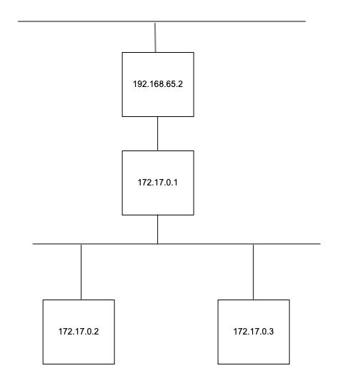

# Lab 4: Computer Networking

Walkthrough video:

**Networks 4-1** [https://www.youtube.com/watch?v=Tq6cKMcNavw](https://www.youtube.com/watch?v=Tq6cKMcNavw)

### Learning Objectives

1. Investigate the networking configuration of a docker container and its local area network
2. Understand some basics around network addresses, net masks, routing tables
3. Learn how to identify active hosts on a network and scan their ports

### Technologies Covered

* Windows, MacOS, Linux
* Bash
* Networking
* nmap, Bash pingsweeps

## 1. Network Interface

To communicate with a TCP/IP network, a computer uses a network interface. This may be connected to a fixed network via an ethernet cable or via a Wi-Fi network. From a TCP/IP perspective, there is little difference and the attributes of the interfaces are the same. The main attributes we are interested in are:

* **Interface Name**: usually&#x20;
  * **Mac**: en0, en
  * **Linux**: wlan0, eth0
  * **Windows**: Local Area Network Connection, Ethernet Adapter Ethernet0, etc.
* **IPv4 Address**: IP version 4 address e.g. 192.168.0.5
* **Subnet Mask**: 255.255.255.0
* **Default Gateway**: Usually the address of your router e.g. 192.168.0.1
* **DNS Server**: Usually again, the address of your router or ISP DNS server

We can get these details using the command `ip addr` on Linux (or if you are on host, `ip addr` on Mac\* and `ipconfig` on Windows).



\***FOR MAC HOSTS ONLY**: you have to first install `iproute2mac` package as below.

```bash
brew install iproute2mac
```

If `brew` isn't installed on your machine, install it by running:

`/bin/bash -c "$(curl -fsSL https://raw.githubusercontent.com/Homebrew/install/HEAD/install.sh)"`

If you get a warning like "warning: /opt/homebrew/bin is not in your PATH", run the following commands in the terminal:

`echo 'eval $(/opt/homebrew/bin/brew shellenv)' >> ~/.zprofile`

`eval $(/opt/homebrew/bin/brew shellenv)`


Then you should be able to see something like below (Mac will look similar to Linux).



```bash
root@d99d71e2318a:/# ip addr
1: lo: <LOOPBACK,UP,LOWER_UP> mtu 65536 qdisc noqueue state UNKNOWN group default qlen 1000
    link/loopback 00:00:00:00:00:00 brd 00:00:00:00:00:00
    inet 127.0.0.1/8 scope host lo
       valid_lft forever preferred_lft forever
2: tunl0@NONE: <NOARP> mtu 1480 qdisc noop state DOWN group default qlen 1000
    link/ipip 0.0.0.0 brd 0.0.0.0
3: sit0@NONE: <NOARP> mtu 1480 qdisc noop state DOWN group default qlen 1000
    link/sit 0.0.0.0 brd 0.0.0.0
8: eth0@if9: <BROADCAST,MULTICAST,UP,LOWER_UP> mtu 1500 qdisc noqueue state UP group default
    link/ether 02:42:ac:11:00:02 brd ff:ff:ff:ff:ff:ff link-netnsid 0
    inet 172.17.0.2/16 brd 172.17.255.255 scope global eth0
       valid_lft forever preferred_lft forever
```



```bash
PS C:\> ipconfig

Windows IP Configuration


Ethernet adapter Ethernet0:

   Connection-specific DNS Suffix  . : uniwa.uwa.edu.au
   Link-local IPv6 Address . . . . . : fe80::3cfc:f569:4be1:6260%15
   IPv4 Address. . . . . . . . . . . : 192.168.114.3
   Subnet Mask . . . . . . . . . . . : 255.255.255.0
   Default Gateway . . . . . . . . . : 192.168.114.1
   
```



For both Mac and Windows, the Graphical User Interface versions of network configuration are more convenient ways of getting this information however (but is not covered in this unit nor needed).

Start the docker container and run `ip addr`

```bash
sudo docker run -it --rm uwacyber/cits1003-labs:network 
```

```bash
root@d99d71e2318a:/# ip addr
1: lo: <LOOPBACK,UP,LOWER_UP> mtu 65536 qdisc noqueue state UNKNOWN group default qlen 1000
    link/loopback 00:00:00:00:00:00 brd 00:00:00:00:00:00
    inet 127.0.0.1/8 scope host lo
       valid_lft forever preferred_lft forever
2: tunl0@NONE: <NOARP> mtu 1480 qdisc noop state DOWN group default qlen 1000
    link/ipip 0.0.0.0 brd 0.0.0.0
3: sit0@NONE: <NOARP> mtu 1480 qdisc noop state DOWN group default qlen 1000
    link/sit 0.0.0.0 brd 0.0.0.0
8: eth0@if9: <BROADCAST,MULTICAST,UP,LOWER_UP> mtu 1500 qdisc noqueue state UP group default
    link/ether 02:42:ac:11:00:02 brd ff:ff:ff:ff:ff:ff link-netnsid 0
    inet 172.17.0.2/16 brd 172.17.255.255 scope global eth0
       valid_lft forever preferred_lft forever
```

We see that the container has 2 network interfaces (ignore the ones with `<NOARP>`). The first is the main ethernet interface with the outside world `eth0` **** (item 8). It has an address in a private IP address range. The second interface is called the loopback interface (item 1) and has what is called the home address `127.0.0.1`.

Alternatively, you can use a `route` command, where we will see the Gateway address is. A gateway is usually a router of some sort, if the machine is not communicating with other machines on the network, it will send its packets to the gateway for it to find where they need to go.

```bash
root@d99d71e2318a:/# route
Kernel IP routing table
Destination     Gateway         Genmask         Flags Metric Ref    Use Iface
default         172.17.0.1      0.0.0.0         UG    0      0        0 eth0
172.17.0.0      0.0.0.0         255.255.0.0     U     0      0        0 eth0
```

We can see that the gateway address is `172.17.0.1`.

Let us start another container and do an `ip addr`. You can do this by opening another terminal and using the same `docker run` command as above. &#x20;

```bash
sudo docker run -it --rm uwacyber/cits1003-labs:network
```

```bash
root@5434bfac0449:/# ip addr
1: lo: <LOOPBACK,UP,LOWER_UP> mtu 65536 qdisc noqueue state UNKNOWN group default qlen 1000
    link/loopback 00:00:00:00:00:00 brd 00:00:00:00:00:00
    inet 127.0.0.1/8 scope host lo
       valid_lft forever preferred_lft forever
2: tunl0@NONE: <NOARP> mtu 1480 qdisc noop state DOWN group default qlen 1000
    link/ipip 0.0.0.0 brd 0.0.0.0
3: sit0@NONE: <NOARP> mtu 1480 qdisc noop state DOWN group default qlen 1000
    link/sit 0.0.0.0 brd 0.0.0.0
10: eth0@if11: <BROADCAST,MULTICAST,UP,LOWER_UP> mtu 1500 qdisc noqueue state UP group default
    link/ether 02:42:ac:11:00:03 brd ff:ff:ff:ff:ff:ff link-netnsid 0
    inet 172.17.0.3/16 brd 172.17.255.255 scope global eth0
       valid_lft forever preferred_lft forever
```

This container has been given an IP address of `172.17.0.3`.

So our network looks like this:

.jpg>)

We can actually communicate between containers. To test this, use the ping command (example below is from the terminal with the address `172.17.0.2`):

```bash
ping -c 1 172.17.0.3
```

```bash
PING 172.17.0.3 (172.17.0.3) 56(84) bytes of data.
64 bytes from 172.17.0.3: icmp_seq=1 ttl=64 time=0.715 ms

--- 172.17.0.3 ping statistics ---
1 packets transmitted, 1 received, 0% packet loss, time 0ms
rtt min/avg/max/mdev = 0.715/0.715/0.715/0.000 ms
```

We will use ping below to scan the network but the way it works is to send a packet of a particular kind to the address and when received, the other host replies. Other than showing that there is a host responding at that address, you can also work out how far away it is because you get the round trip time (`rtt` at line 7) which in this case is 0.715 ms.

Now we are going to ping our host, which is at `172.17.0.1`.


If you are running on a host, then the Docker has a special address for that which is `host.docker.internal`.


Let us ping that:


```bash
root@d99d71e2318a:/# ping -c 1 172.17.0.1
PING 172.17.0.1 (172.17.0.1) 56(84) bytes of data.
64 bytes from 172.17.0.1: icmp_seq=1 ttl=64 time=1.03 ms

--- 172.17.0.1 ping statistics ---
1 packets transmitted, 1 received, 0% packet loss, time 0ms
rtt min/avg/max/mdev = 1.496/1.496/1.496/0.000 ms
```

If you are running from the Host, you will observe that it also shows an IP address, which starts with 192.... So this is on a different network (still a private one, however). Docker also has a `hostname` for the gateway on this network which is `gateway.docker.internal`**.**

So our network technically looks like this:



It is actually a little more complicated than this but we will use another tool to explore the network.&#x20;

## 2. Scanning the network

We are interested in finding out what other computers are on the network and we can do that using a tool called `nmap`.

`nmap` performs scans on computer networks to detect if other devices are connected. If it finds a host, it can also scan for open ports that indicate specific services that the computer is using. We are mainly interested in finding other hosts and so we will be limiting the scan to what is called a Ping Sweep. When you ping another computer on the network, it involves sending a TCP/IP packet to the computer to say "are you there" to which the other computer usually replies and says "yes". Technically, a ping is an ICMP Echo Request to which the response is an ICMP Echo Reply (don't worry, you will learn more about these in the networks unit).

In the following example, our computer's IP address is `10.0.1.2` and the gateway (the router) is `10.0.1.1`

```bash
$ ping -c 1 10.0.1.1
PING 10.0.1.1 (10.0.1.1): 56 data bytes
64 bytes from 10.0.1.1: icmp_seq=0 ttl=255 time=1.563 ms

--- 10.0.1.1 ping statistics ---
1 packets transmitted, 1 packets received, 0.0% packet loss
rtt min/avg/max/stddev = 1.563/1.563/1.563/0.000 ms
```

Using the ping command to send 1 ping (`-c 1`), we get a reply which took 1.563 ms to send the message and then get the reply. This time is known as the round-trip time (`rtt`).

`nmap` uses different ways of doing the same thing as a ping to determine if a computer is on the network. It isn't always reliable because sometimes computers are configured not to reply to pings, or a firewall will block them.

Let us go back to our docker container and scan the network `172.17.0.0/24`. Just as a reminder, this notation means that we are going to check the computers with IP addresses that range from `172.17.0.0` - `172.17.0.255` (the `/24` means that the network part is `172.17.0` and so is fixed).


Host users, scan `192.168.65.0/24` &#x20;
Ensure that you replace the address above with the address you have found when pinging `host.docker.internal`.


To use `nmap` to perform a ping scan we use the following (note, this takes some time):

```
nmap -sn 172.17.0.0/24
```

```bash
Starting Nmap 7.80 ( https://nmap.org ) at 2023-02-02 02:55 UTC
Nmap scan report for 172.17.0.1
Host is up (0.0081s latency).
Nmap scan report for 172.17.0.3
Host is up (0.0036s latency).
Nmap scan report for 1979a01db783 (172.17.0.2)
Host is up.
Nmap done: 256 IP addresses (3 hosts up) scanned in 2.11 seconds
```

On this network, we found 3 hosts (your result may vary depending on where you are scanning from):

* 172.17.0.1
* 172.17.0.2
* 172.17.0.3


`nmap` does have the ability to try and work out what operating system is running on a device and of course will discover services that are running as well. Before we look at that, let us try a different approach by using a script to discover hosts:

The following script is in a file `/root/pingsweep.sh`

```bash
#!/bin/bash
 host_is_up() {
   ping -c 1 -w 1 "${ip}" > /dev/null
 }
for i in {1..254}; do
   ip="$1.${i}"
   if host_is_up "${ip}"; then
       echo "${ip}"
   fi
done
```

Run the script by doing:

```bash
./root/pingsweep.sh 172.17.0
```

```bash
192.168.65.1
192.168.65.2
192.168.65.3
192.168.65.4
192.168.65.5
```

Essentially you get the same result as using the nmap above. The whole point of the script is that you are now able to customize the script to do other things!

## 3. Service discovery with `nmap`

Nmap uses a number of strategies to discover what services are running on a machine once it has discovered that it is actually available. Service discovery is done via a range of scripts that come with the `nmap` program. We can run them as follows (note, this takes a very long time!):

```bash
nmap -sC -sV 172.17.0.1-3
```

The below example is running the same command but with a Windows host (because the output is more interesting).

```bash
Starting Nmap 7.80 ( https://nmap.org ) at 2022-02-02 03:01 UTC
Nmap scan report for 192.168.65.1
Host is up (0.0044s latency).
Not shown: 998 filtered ports
PORT     STATE SERVICE     VERSION
53/tcp   open  domain?
| fingerprint-strings:
|   DNSVersionBindReqTCP:
|     version
|_    bind
3128/tcp open  squid-http?
| fingerprint-strings:
|   FourOhFourRequest, GetRequest, HTTPOptions:
|     HTTP/1.1 400 Bad Request
|     transfer-encoding: chunked
|     <html><head>
|     <meta http-equiv="Content-Type" content="text/html; charset=utf-8">
|     <title>ERROR: connection refused</title>
|     </head><body>
|     HTTP request must contain an absolute URI e.g. http://github.com/moby/vpnkit
|     <br>
|     <p>Server is <a href="https://github.com/moby/vpnkit">moby/vpnkit</a></p>
|     </body>
|_    </html>
| http-open-proxy: Potentially OPEN proxy.
|_Methods supported:CONNECTION
2 services unrecognized despite returning data. If you know the service/version, please submit the following fingerprints at https://nmap.org/cgi-bin/submit.cgi?new-service :
<--SNIP-->

Nmap scan report for 192.168.65.2
Host is up (0.0046s latency).
Not shown: 994 filtered ports
PORT     STATE SERVICE         VERSION
<--SNIP-->

Nmap scan report for 192.168.65.3
Host is up (0.0000040s latency).
Not shown: 999 closed ports
PORT    STATE SERVICE VERSION
111/tcp open  rpcbind 2-4 (RPC #100000)
| rpcinfo:
|   program version    port/proto  service
|   100000  2,3,4        111/tcp   rpcbind
|   100000  2,3,4        111/udp   rpcbind
|   100000  3,4          111/tcp6  rpcbind
|   100000  3,4          111/udp6  rpcbind
|   100024  1          36985/udp   status
|   100024  1          38418/udp6  status
|   100024  1          38507/tcp   status
|_  100024  1          54161/tcp6  status

Nmap scan report for 192.168.65.4
Host is up (0.0000040s latency).
Not shown: 999 closed ports
PORT    STATE SERVICE VERSION
111/tcp open  rpcbind 2-4 (RPC #100000)
| rpcinfo:
|   program version    port/proto  service
|   100000  2,3,4        111/tcp   rpcbind
|   100000  2,3,4        111/udp   rpcbind
|   100000  3,4          111/tcp6  rpcbind
|   100000  3,4          111/udp6  rpcbind
|   100024  1          36985/udp   status
|   100024  1          38418/udp6  status
|   100024  1          38507/tcp   status
|_  100024  1          54161/tcp6  status

Nmap scan report for 192.168.65.5
Host is up (0.000015s latency).
Not shown: 999 closed ports
PORT   STATE SERVICE    VERSION
53/tcp open  tcpwrapped

Service detection performed. Please report any incorrect results at https://nmap.org/submit/ .
Nmap done: 5 IP addresses (5 hosts up) scanned in 250.21 seconds
```

We run `nmap` using the `-sC` (all scripts) and `-sV` (determine the versions of software providing the services discovered). In the example above, we specified the hosts to scan as `192.168.65.1-5` to just look at the hosts we found before (replace the range as appropriate).

So what we have is (for this example):

* 192.168.65.1 running DNS (53) and an HTTP Proxy (3128)
* 192.168.65.2 this is the address for the PC running the script (your output may vary)
* 192.168.65.3 RPC Services (111)
* 192.168.65.4 RPC Services (111)
* 192.168.65.5 DNS (53)

There are 2 DNS servers but we can tell which one is used by our Docker container by looking at the file where this is specified called `resolv.conf` located in the `/etc` directory.

```bash
root@04f7c0bbd066:/# cat /etc/resolv.conf
# DNS requests are forwarded to the host. DHCP DNS options are ignored.
nameserver 192.168.65.5
```

The other DNS service is paired with an HTTP proxy. This is a piece of software through which requests for external websites are made. From the Docker documentation, the host 192.168.65.1 is used to proxy requests to the Docker registry, the other 2 hosts, `192.168.65.2` and `.3` are used for internal purposes as well.

### Question 1. Scanning a remote access service

Now that we know the basics of using `nmap`, let us use it on a new host. Keep the network container running from above (or start it if you haven't got it running). In a new terminal, start the docker container:

```bash
sudo docker run -p 2222:2222 -it --rm uwacyber/cits1003-labs:cowrie
```

Back in the `network` container, do a ping scan of the `172.17.0.1-16` network and find what hosts are up. Run `nmap` against the IP of the new container you ran using all scripts and versions.

What is the service that you have found?



Hints are available on the next tabs.



To scan for the hosts:

`$ nmap -sn 172.17.0.1-16`



To scan with all scripts and versions of the specific target IP

`$ nmap -sC -sV 172.17.0.3`

If the IP address of the host you want to scan is different then use that address instead



Try connecting to the service you found using the user root and no password. You will need to use a `ssh` command (try `ssh -help`), where you have to specify the port to be `2222`, and login as the `root`. Note, there is no password to login as root.

Once you have successfully logged on the machine as root, look at the file `/etc/passwd`

**Flag: Enter the flag from** `/etc/passwd`


The cowrie container you started is actually a HoneyPot and logs everything that anyone does when interacting with it. Have a look at the output in the terminal where you ran it.

HoneyPots are deliberately left exploitable to attract potential attackers and watching what they do.


### Question 2. Understanding honeypot responses

Inspect the output (i.e. log) in the honeypot server terminal. You will see a list of actions taken on the server, whether it be itself or via the remote login user. You may be able to figure out by only reading the log what actions are taken on the honeypot server.

There are three types of keypairs generated by the honeypot server when an ssh connection is established for the very first time.

**Flag: Enter the three types of keypairs generated in order, separated by a comma no spaces (e.g., `CITS1003{type1,type2,type3}`).**

### Question **3**. Established crypto algorithms

When an ssh connection is initiated, the server negotiates the crypto algorithms to use for data exchange. For our honeypot server, both the incoming and outgoing crypto algorithms are the same.

**Flag: Enter the crypto algorithms (in order of appearance) used by the honeypot server to exchange data with the ssh connection. The algorithms are separated by a comma, no spaces (e.g., `CITS1003{algorithm1,algorithm2}`).**&#x20;

## **Case study: The Heartbleed Bug**

The Heartbleed Bug was a serious vulnerability within OpenSSL, which is widely used to secure communications on the internet. The bug allows attackers to read unauthorized memory from affected servers. This memory could contain sensitive information that should have been protected by the SSL/TLS encryption used to secure internet communications. It has affected many popular websites and services, potentially exposing sensitive information such as usernames, passwords, and credit card numbers.

Read through the following article and answer the questions below: [https://www.vox.com/2014/6/19/18076318/heartbleed](https://www.vox.com/2014/6/19/18076318/heartbleed)

### Question 4. Heartbleed

Which of the following accurately describes the Heartbleed vulnerability? &#x20;

1. A cyber attack involving flooding requests to an OpenSSL-based server, causing it to crash.&#x20;
2. A hardware vulnerability in an OpenSSL-based server allowing unauthorized information access.&#x20;
3. Malware infecting an OpenSSL-based server for sensitive information theft/modification.&#x20;
4. A software flaw allowing reading excessive information beyond user requests.


Submit the correct option as your flag (e.g., CITS1003{1} if option 1 is the correct answer).


### Question 5. OpenSSL

Which of the following best describes the role of OpenSSL in internet security? &#x20;

1. OpenSSL is a web browser used to access secure websites.&#x20;
2. OpenSSL is a programming language used to create encrypted websites.&#x20;
3. OpenSSL is a software that enables computers to communicate via encryption.&#x20;
4. OpenSSL is a hardware device used to protect network connections.


Submit the correct option as your flag (e.g., CITS1003{1} if option 1 is the correct answer).



### Question 6. Countermeasure

What mitigation was implemented to address the Heartbleed vulnerability?&#x20;

1. Encrypting all data transmitted over SSL connections.&#x20;
2. Restricting the use of heartbeat messages in SSL communication.&#x20;
3. Implementing stricter data check to prevent excessive information disclosure.&#x20;
4. Disabling SSL encryption on affected servers.


Submit the correct option as your flag (e.g., CITS1003{1} if option 1 is the correct answer).


