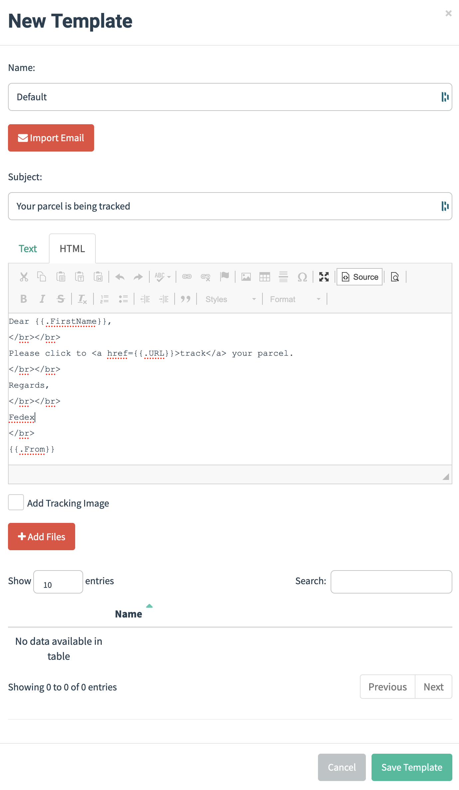

# Lab 5: Threats Social Engineering

Walkthrough video:

**Social Engineering 5-1** [https://www.youtube.com/watch?v=JJ4teHYInDg](https://www.youtube.com/watch?v=JJ4teHYInDg)

***

## What is Social Engineering? <a href="#what-is-social-engineering" id="what-is-social-engineering"></a>

In many cases, if you want access to a network, machine or even physical premises, the easiest thing to do is to simply ask for it, especially if you pretend to be someone that has a legitimate reason to be asking. More formally, social engineering is the use of deception to manipulate a person into revealing some information or taking some sort of inappropriate action on the attacker's behalf. Social engineering relies on exploiting human behavior based on both their general human behaviors, and also through manipulation of individuals based on their personal life or work.

Social engineering takes advantage of the fact that people generally:

* want to be helpful
* tend to trust people and communications that come from trusted people
* are concerned about getting in trouble
* are willing to cut corners
* are willing to believe in good fortune
* don't understand how technology works

Take all of these factors, add to them the number of legitimate emails that prompt for some sort of interaction, it is not surprising that getting people to do something that allows attackers to capture credentials, or run malware, is relatively straightforward.

The principal way in which social engineering attacks are made is through phishing. Attackers primarily use email to carry out attacks but the same techniques can be applied to phishing by way of SMS, direct messages in messaging apps, automated robocalls through telephones and even videoconferencing apps.

The goal of a phishing attack is to either get a user to click on a link that takes them to a site under the attacker's control, or downloads and installs malware directly. In another variant, malware may be sent directly as an attachment of the message and the receiver of the email is socially engineered into installing the malware directly.

We are going to look at phishing in more detail by exploring the use of a social engineering tool called Gophish. We will focus on attacks that trick a user into providing credentials on a fake login page copied from a genuine service.

## 1. Going Phishing with Gophish <a href="#going-phishing-with-gophish" id="going-phishing-with-gophish"></a>

Phishing provides the largest and potentially most effective way of getting malware onto a computer or convincing a target to reveal their user credentials, personal or financial information and even take other actions on the attacker's behalf. Phishing's most common channel is email and there are a number of tools that simplify the ability to create phishing emails, send them to targets and monitor the responses.

The tool we will use is called **Gophish** which is written in the programming language _Go_ and handles phishing campaigns and monitor the results. Although it can be used for attacking, it can also be used for training staff in cybersecurity awareness by auditing how many would respond to a particular phishing attack.

Phishing attacks are generally never one-off events but are instead part of a campaign which is a series of attacks carried out over a period of time to achieve a set of goals.

Setting up a campaign involves; using an SMTP server to send the mail, choosing the email text that you want to send, and selecting the users that the emails are going to be sent to. To get an idea of how this works in practice, we can run through a simple example of setting up a credential harvesting website locally and sending a phishing email.

There are a number of challenges an attacker needs to overcome when sending phishing emails and that is a large reason that so many of them don't get through to the victim and end up in the spam folder instead. The first is finding an open relay SMTP server. An SMTP server is said to be an open relay when it allows unauthorized emails to be sent through it and allows the sender email address and display name to be spoofed. An alternative to finding an open relay SMTP server is for the attacker to set up their own SMTP server. In either case, SMTP servers can become blacklisted if they are seen to be sending out large numbers of emails that have been flagged as spam or phishing. A blacklisted SMTP server may be prevented from sending emails and may have all of its emails flagged as spam.

An attacker could also use stolen credentials to use a legitimate email service to send emails and this might work when the email attack is targeted at a specific person, an attack known as a _spear phishing attacks_.

Choosing the content of the email involves the attacker masquerading as a sender and creating an email in the style of one that would be sent by them. Attackers often pretend to be a group like IT support or help desk asking for email account verification. Other commonly spoofed organizations are couriers or postal services sending emails that claims there to be unpaid shipping on a parcel that contains something of value. You will have likely seen many examples of these types of emails arriving in your inbox or spam folder on a daily basis.

Setting up a spoofed website is perhaps the easiest part of the phishing campaign. In our example we are going to clone the GitHub login page, but it is straightforward to use any social media login pages, or any other company's login page for that matter (e.g., banks). Once the spoofed site is set up, `Gophish` will record visits to the site and optionally will record the usernames and passwords entered by victims. Once the credentials are harvested, the user can be redirected to the real site to reduce suspicion that they were tricked.

Normally, an attacker would make the site more convincing by using SSL and having a certificate that matched the domain name chosen for the site. Users have been taught to make sure that the sites they visit are protected by looking for the _padlock_ in the browser that indicates the site is using SSL and that the certificate is valid. (Most) Browsers will now warn users when they visit a site that is not SSL protected. Also, you would want a URL that is close enough to the real URL you are spoofing in order to pass casual scrutiny by the user. In our exercise, we are not going to bother with SSL certificates or setting up a domain for the URL.

## 2. Creating a phishing campaign in Gophish <a href="#creating-a-phishing-campaign-in-gophish" id="creating-a-phishing-campaign-in-gophish"></a>

To run Gophish, start the Docker container as follows

```bash
sudo docker run -p 3333:3333 -p 8880:80 -it --rm uwacyber/cits1003-labs:gophish
```

```bash
<SNIP...>
"Please login with the username admin and the password 9c83d59621ff4573"
time="2022-02-07T06:57:07Z" level=info msg="Starting IMAP monitor manager"
time="2022-02-07T06:57:07Z" level=info msg="Starting phishing server at http://0.0.0.0:80"
time="2022-02-07T06:57:07Z" level=info msg="Background Worker Started Successfully - Waiting for Campaigns"
time="2022-02-07T06:57:07Z" level=info msg="Creating new self-signed certificates for administration interface"
time="2022-02-07T06:57:07Z" level=info msg="Starting new IMAP monitor for user admin"
time="2022-02-07T06:57:07Z" level=info msg="TLS Certificate Generation complete"
time="2022-02-07T06:57:07Z" level=info msg="Starting admin server at https://0.0.0.0:3333"
```

When run, Gophish will start two web servers, one on port 80 (which we have mapped to port 8880 on our local machine) that will host the phishing landing pages and the other on port 3333 (mapped to the same port on our local machine) which is the administration site. Open the admin site in a browser by going to `https://0.0.0.0:3333`&#x20;


If using host, go to `https://127.0.0.1:3333`



Gophish uses https and we haven't set up a certificate for it. To proceed to the site, the browser will ask you to accept the risks and proceed. How you do this will depend on the browser.


You can log in with the user `admin` and the password that was printed out on the console when you ran it. You will be prompted to change the admin password, but set it to something not related to what you normally use (e.g., use `password`). You will see the Dashboard shown here.


To start, we will create a sending profile.

We are going to run a mail server as another container and so when asked, the hostname for the email server is  `https://172.17.0.1:1025`(if using host: `host.docker.internal:1025`).

Let us do that now. In another terminal, run the following container:

```bash
sudo docker run -it --rm -p 1080:1080 -p 1025:1025 uwacyber/cits1003-labs:maildev
```

```bash
MailDev using directory /tmp/maildev-1
MailDev webapp running at http://0.0.0.0:1080
MailDev SMTP Server running at 0.0.0.0:1025
```

This mailserver will allow you to see what emails are arriving by going to the address `http://0.0.0.0:1080`(if using host: `http://127.0.0.1:1080)`.

Back to `gophish` site, click on `Sending Profiles` and then add`New Profile` and then complete the form using the details shown below. In the From field, the name that you add here will be displayed in the receiver's inbox. Some SMTP server (like Gmail) will override this with the email of the account used to send the mail and so to fully control it you need your own SMTP server. For our example using the local SMTP server, it is connected by the host's IP address, so we will put `Host` as `172.17.0.1:1025` (if running on host, use `host.docker.internal:1025`).


You can send a test email (you can populate the fields with random values) and verify that it shows up in the MailDev interface. Delete it once done. Save the profile.


The test email will unlikely be sent to the address you have specified so don't worry whether you will be flooding someone's inbox or not.


Next, we are going to create an email template (go to `Email Templates` tab). We are going to keep this simple. In a real phishing campaign, you could model this on something a little more realistic but never underestimate what people will click on.

In the template, give it a name and then select HTML. Enter the HTML below.

We are using a few template variables that will be replaced with the recipient's first name and the sender's information (you can look up what other variables you can use in emails on the Gophish GitHub page). Most importantly, the URL that will be clicked will be replaced with the landing page we will create and also pass an ID that will allow us to track which users clicked on the email.

```bash
Dear {{.FirstName}},
</br></br>
Please click to <a href={{.URL}}>track</a> your parcel.
</br></br>
Regards,
</br></br>
Fedex
</br>
{{.From}}
```



Save the template and now click on `Landing Page` and add `New Page` to create a new landing page. We can use the Import Site button to import the page from the GitHub Login page (`https://github.com/login`) and add the same URL to redirect to after the credentials are captured. The page we have imported has a few variables of its own in `{{ }}` so you need to click on the source button and remove any of those that you find. If you try and save the template without removing them, you will get an error.

Select to track submitted data \*and\* to capture passwords (well, why not?)


Now that this has been done, we need to define the list of users to send emails to in the `Users & Groups` page. Here, just add 2 made up users, it doesn't really matter what they are. The first and last name and position can all be used within the email templates to add to the personalization of the emails sent.

Finally, we can create a campaign and send the phishing email. In `Campaign`, click `New Campaign` and fill out the details. For the URL, you want to use `http://0.0.0.0:8880` (if using host `http://127.0.0.1:8880`, and later to run a user simulation change this to `http://host.docker.internal:8880`).\\


Once the Launch Campaign button is pressed, the email should be sent and you should see the emails in MailDev

Select one of the emails and click on the link.

Entering a username and password and clicking Sign in should then redirect you to the GitHub login page with no feedback. Note that if you actually have a GitHub account and are already authenticated by the browser, when the phishing landing page redirects, it will take you straight to your default GitHub page and so it will look like the login was successful.

The Dashboard page on Gophish will update to say that the email was clicked and that you visited the landing page.


You can click the Submitted Data button to view the details of the interaction with the target page and see the data entered in the login page.



You can click the link directly from the `maildev`, as you will unlikely to actually receive this phishing email yourself. Because we are only phishing without piggybacking malicious scripts, it is safe to click the link.&#x20;

Do remember NOT to input your real credentials though (traffic isn't encrypted)!


### Question 1. User Simulation

We will run a user simulation program that will automatically read the emails sent and randomly 'click' on the link (it happens about 30% of the time). In another terminal (while `gophish` and `maildev` still running), run:



```bash
sudo docker run -it --rm --add-host host.docker.internal:172.17.0.1 uwacyber/cits1003-labs:usersim
```



```bash
sudo docker run -it --rm uwacyber/cits1003-labs:usersim 
```



```bash
deleting Z3MGBGKK
deleting wMKhhn09
Clicking on http://host.docker.internal:8880?rid=EDi8ErW
```

Launch another campaign and you should see the `usersim` simulate clicks.

**Flag: After running `usersim`, look at the emails in MailDev. You should see the flag.**


## Case study: 15 Examples of Real Social Engineering Attacks

Social engineering attacks are one of the main ways bad actors can scam companies.

Read through the following article and answer the questions below:
[https://www.tessian.com/blog/examples-of-social-engineering-attacks/](https://www.tessian.com/blog/examples-of-social-engineering-attacks/)

### Question 2. Phishing type

According to the article, what type of phishing was used by the scammers against Google and Facebook? &#x20;

1. Whale phishing &#x20;
2. Vishing &#x20;
3. Spear phishing &#x20;
4. Smishing &#x20;


Submit the correct option as your flag (e.g., CITS1003{1} if option 1 is the correct answer).


### Question 3. Business Email Compromise

In Example 9, how did the Business Email Compromise scam evade rule-based email security?&#x20;

1. By using image files of the Microsoft Windows logo. &#x20;
2. By creating borderless tables and splitting certain words. &#x20;
3. By crafting a table of a four-square grid with colors that look like the Windows logo. &#x20;
4. By including an attachment that looks like an Excel spreadsheet file (.xlsx).



Submit the correct option as your flag (e.g., CITS1003{1} if option 1 is the correct answer).


### Question 4. Smishing Scam

In Example 15, what was the specific tactic used by the scammers?

1. The attackers claimed to be financial institutions and requested account details. &#x20;
2. The attack involved impersonating government agencies, urging recipients to click links for urgent updates. &#x20;
3. The attackers used email phishing techniques, pretending to be colleagues and requesting sensitive work-related information. &#x20;
4. Cybercriminals posed as delivery companies, prompting recipients to click a link for an undelivered package.



Submit the correct option as your flag (e.g., CITS1003{1} if option 1 is the correct answer).


## Case study 2: Scams and Phishing at UWA

The University receives more than two million emails every day. More than 95 percent of these are malicious and do not get delivered as they can cause harm.

Read through the following article and answer the questions below: 
[Cyber security 101 for students](https://www.uwa.edu.au/students/support-services/cyber-security-101-for-students#:~:text=If%20you%20receive%20phishing%20or,others%20from%20the%20same%20scam.)

### Question 5. University IT's Tips

Which of the following is NOT the tip the University IT provides in mitigating cyber scams?&#x20;

1. Never respond to requests for personal information via email.&#x20;
2. Type the known website address directly into the address bar in the internet browser. &#x20;
3. Enable Multi-Factor Authentication and do not share passwords. &#x20;
4. Check the list of recipients of the email, as phishing attempts often will try and target a large number of people.


Submit the correct option as your flag (e.g., CITS1003{1} if option 1 is the correct answer).


### Question 6. What To Do When Scammed

You can report emails you suspect to be phishing emails in Outlook by using the Report Message add-in and selecting the \_\_\_\_\_\_\_\_ option:&#x20;

1. Report junk &#x20;
2. Report phishing &#x20;
3. Not junk &#x20;
4. Options &#x20;
5. Help


Submit the correct option as your flag (e.g., CITS1003{1} if option 1 is the correct answer).


