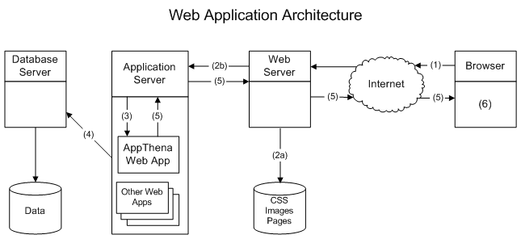
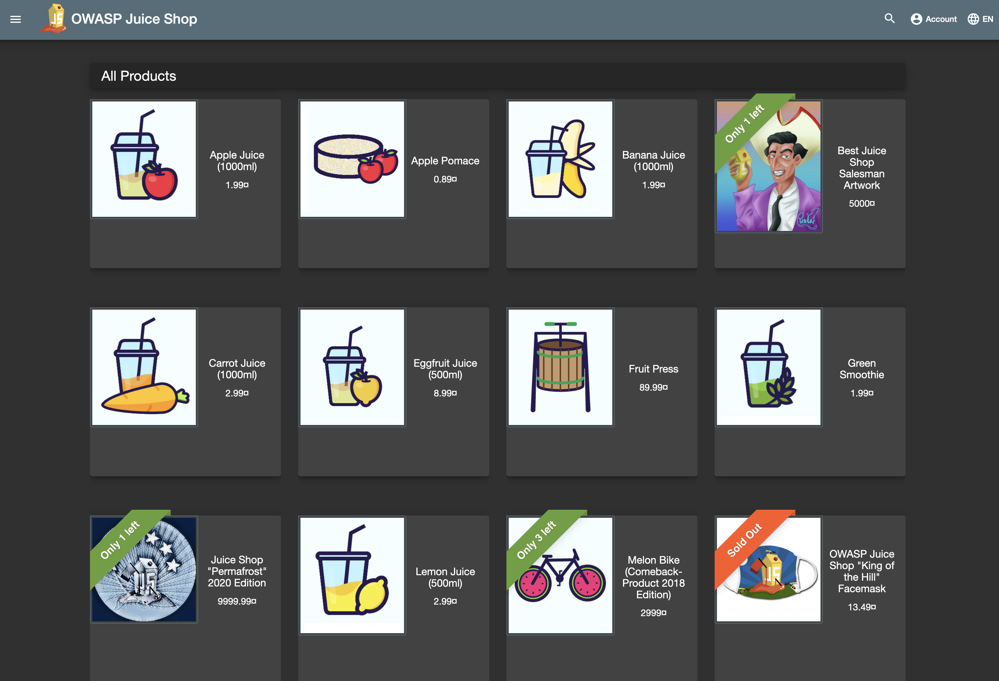
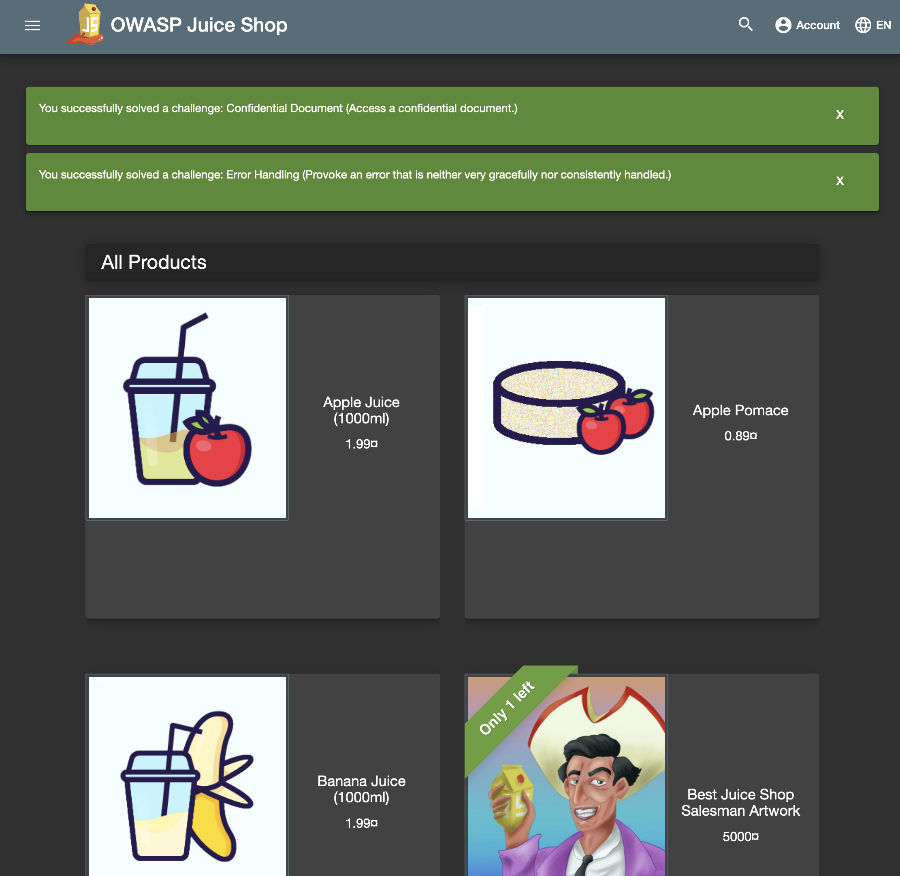
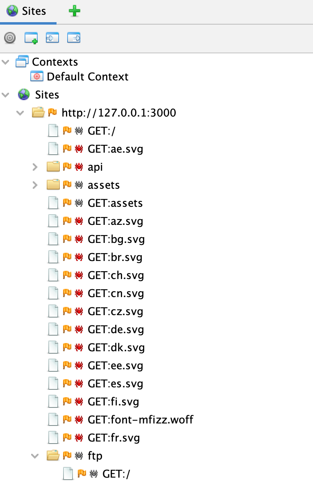
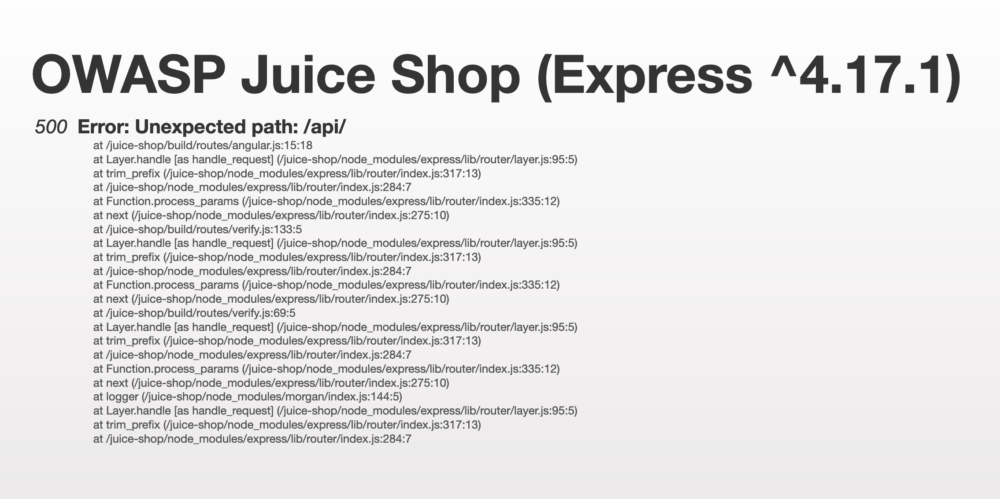
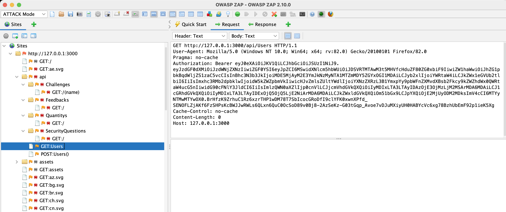
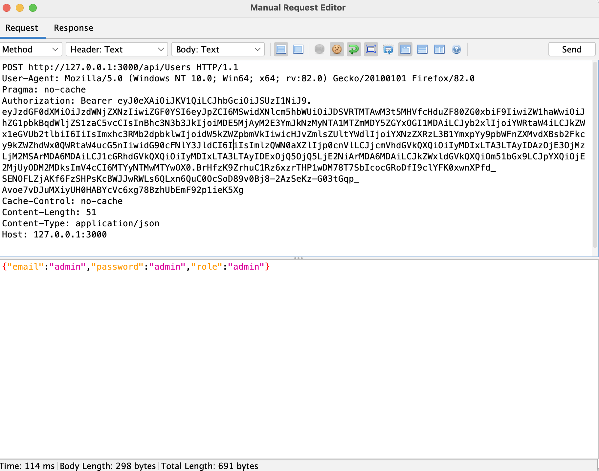

# Lab 6: Vulnerabilities


PLEASE NOTE: This lab image uses a lot of storage space (storage size is over 2.5GB!), so ensure you have enough space on your hard drive before proceeding.


Walkthrough video:

**Vulnerabilities 6-1** [https://www.youtube.com/watch?v=UgY3n4xplR4](https://www.youtube.com/watch?v=UgY3n4xplR4)

## What is a vulnerability?

In cybersecurity terms, a vulnerability is (according to NIST):

> "A weakness in an information system, system security procedures, internal controls or implementation that could be exploited by a threat source.”

That actually doesn't help us very much because just because a threat source might exploit a weakness, it might not have an impact on the organisation in any noticeable way (can you think of any?).

A complicating factor of vulnerabilities is the fact that they are a weakness in people as well as physical and electronic objects. For the most part, when we talk about vulnerabilities in the context of this lab, we will be talking about software vulnerabilities (i.e., vulnerabilities in the cyber domain).

Vulnerabilities are usually quantified in some way using a range of different characteristics and severity. One such scheme is the Common Vulnerability Scoring System (CVSS Scores), which provides a range of between 0-10 to represent the _severity_ of the vulnerability. Vulnerabilities are identified by different organisations using their own identifiers, but there is a standard one provided by the MITRE organisation called the Common Vulnerabilities and Exposures (CVE) identifier. For example, the CVE `CVE-2017-00144` ([https://cve.mitre.org/cgi-bin/cvename.cgi?name=cve-2017-0144](https://cve.mitre.org/cgi-bin/cvename.cgi?name=cve-2017-0144)) relates to a vulnerability in Microsoft Windows file sharing protocols that was exploited by the WannaCry ransomware. This vulnerability was identified by Microsoft as `MS17-010`.

## How do we find vulnerabilities?

Vulnerabilities can be split into known and unknown types. For the known vulnerabilities, they will typically be given an identifier (e..g, CVE ID), which will relate to a particular configuration or version of the software. If you know you have a particular version of Windows for example, there will be a list of known vulnerabilities that can be looked up in a vulnerability database. For this reason, finding vulnerabilities usually starts with understanding all of the software and system configurations that are running, especially the versions of the software and the way they have been set up and deployed.

There are tools that will do automated scans of software, especially web servers. But what is a web server and what are the applications that they run?

## 1. Web Applications

Websites are a collection of files that provide (static) formatting instructions as to a browser about how to layout content on a page. This comes in the form of HTML (Hypertext Markup Language), CSS (Cascading Style Sheets) and media files such as images. Dynamic behaviour to add interactivity to a page in the browser can be added, such as using _JavaScript_. JavaScript can also alter the formatting of a page by interacting with a rendered page's Document Object Model (DOM). The DOM is the way the browser organizes the HTML elements that control the formatting of the page. The below diagram provides an overview of how different elements interact with each other.



A webpage can communicate with other programs running on servers (steps 1 and 2b) by submitting data through the use of HTML forms, or by using communications technologies such as Web Sockets and Ajax (Asynchronous JavaScript and XML). This communication can be handled using a variety of different programming frameworks and web services including REST (Representational State Transfer), Python Django, Ruby on Rails and ASP.NET (to name just a few of the many). Don't worry, you don't have to know these, for now.

Web services that are provided by applications running on servers typically interact with database technologies of some kind to handle the data used by the application (step 4). This will be either a relational database of some sort (some examples of which are MySQL, PostgreSQL, Microsoft SQL Server, Oracle) or what is called a NoSQL database (for example, MongoDB, AWS Dynamo DB, Azure Cosmos DB).

It is the interactivity of websites and applications that make them vulnerable to exploitation and give attackers the ability to execute commands on the remote machine, or view or alter files on that machine. Although there are many ways in which the interaction of browser, web applications, operating systems and databases can be exploited, we are going to focus on the top 10 most common types of vulnerabilities that are exploited by attackers.

## 2. OWASP Top 10 Web Vulnerabilities

Whilst browsing a website, there are a number of specific types of vulnerabilities that you would be looking for. This starts with identifying the software being used for the site, the directory structure as outlined in the previous chapter, and then concentrating on the functionality of the site.

When looking for vulnerabilities, it is worth concentrating on the most common. The Open Web Application Security Project (OWASP) maintains a list of the top 10 most critical security risks to web applications (find it at: [https://owasp.org/www-project-top-ten/](https://owasp.org/www-project-top-ten/)). The latest list (2021) is:

1. Broken Access Control
2. Cryptographic Failures&#x20;
3. Injection
4. Insecure Design
5. Security Misconfiguration
6. Vulnerable and Outdated Components
7. Identification and Authentication Failures
8. Software and Data Integrity Failures
9. Security Logging and Monitoring Failures
10. Server-Side Request Forgery (SSRF)

There are tools that will scan a web application automatically for these vulnerabilities with varying degrees of success. Some of these tools include OWASP ZAP, Burp Suite Professional, OpenVAS and Nessus to name a few. We will be doing the process manually however because it is important to understand the underlying mechanisms by which these vulnerabilities work, and also how they can be mitigated.

## 3. Exercise: Running a vulnerable web application OWASP Juice Shop

OWASP Juice Shop is a modern web application that has a range of vulnerabilities in the OWASP top 10 list. We will look at some of these vulnerabilities, but you can spend more time to see if you can find others. The site will let you know when you find one by creating a green alert. We are going to use OWASP ZAP to scan the website initially. This won't find all of the vulnerabilities, in fact, it only finds a few but it will give us a "crawl" of the site, providing a list of all the links it can find that access different parts of the site.

To run the website, use the Docker command :

```
sudo docker run -it --rm -p 3000:3000 uwacyber/cits1003-labs:juiceshop
```


You must run the provided juice-shop image, as it has been custom-built for this lab (the default image from OWASP will not contain the correct flags you need).


This will start the website on port 3000. You can access it using the URL on your browser `http://localhost:3000` or `http://172.17.0.1:3000` (or on host `http://127.0.0.1:3000`) and should see the home page:



Before we look at the site, we are going to install a program called OWASP ZAP that will perform an automated vulnerability scan on the site. Please remember, using tools such as ZAP on any of the servers that you do not have permission to do so is **ILLEGAL**.



This is least resource intensive, especially running on a VM (the docker method will be quite slow).

Install OWASP ZAP for your platform from [https://www.zaproxy.org/download/](https://www.zaproxy.org/download/)
If you are on Kali, you can download the Linux version (this works for Apple Silicon too).

To install, you must be root, i.e.,:

```bash 
sh ZAP_11_1_unix.sh
```

Once the installation finished following the GUI prompt (default settings should be fine), the ZAP application should now be available.

Now you can begin your attack e.g., your attack address will be `http://172.17.0.1:3000` in your Kali VM.



You can run OWASP ZAP as a Docker container by using the command:

`$ sudo docker run -u zap -p 8080:8080 -p 8090:8090 -i --rm owasp/zap2docker-stable zap-webswing.sh`

You then access it through your browser using the URL `http://localhost:8080/zap`

Since this is running within a container, you need to use the host address `host.docker.internal` instead of `127.0.0.1`

If you receive a message to restart your ZAP session, it will be better for you to run the ZAP application instead.



Open ZAP and configure the software to scan the Juice Shop website:&#x20;

1. In the top left hand corner, select "ATTACK Mode" in the dropdown.&#x20;
2. Select `Automated Scan` by clicking the button in the right-hand window.&#x20;
3. Type in the URL of the Juice Shop `http://172.17.0.1:3000` (or `http://host.docker.internal:3000` if using the container version, or  if on host `http://127.0.0.1:3000` )&#x20;
4. Tick both `User traditional spider` and `Use ajax spider with Firefox Headless`, then click "Attack".


If the Quick Start tab is missing, simply restart ZAP.



Sometimes it will tell you the URL is invalid. Just press the "Attack" button again and it should run okay.


The scan will take a (longish) while but you will notice that the Juice Shop has popped up green alerts announcing that you have solved two challenges!



The first alert suggests that you have found a confidential document. If you go back to ZAP and expand the node `http://172.17.0.1:3000` (or `http://127.0.0.1:3000`) that is under the `Sites` listing on the left hand side, you will see a node in the tree that is called "ftp"



FTP is the File Transfer Protocol and is used to allow users to get files from a server i.e. an early version of DropBox or OneDrive.

### Question 1. Read the FTP files

If you click on the FTP node, you will see a number of files. Some of these files are highly confidential (hint hint). You can inspect them by selecting the `<-- Response` tab button from the right-hand window. You should be able to read the text of the file in the lower window.

**FLAG: there is a flag in one of those files!**

Why is this a vulnerability? Well, for a start it didn't require usernames and passwords to access, in other words, it allowed _anonymous_ access. Secondly, as mentioned previously, sensitive files should not be left on servers without encryption of any sort and even then, they should be made available only to the people who need to see it. So this is one of OWASP's _Broken Access Control_.

## 4. Second Error

The second error reported that there was a problem with Error Handling. This vulnerability occurs when the application does not handle errors correctly and the application returns extra information about the error and where it occurred. This can reveal a lot about the website and the code it is running to an attacker.

To find this error, go back to ZAP and click on the `Active Scan` tab in the bottom window. Sort the output by Code with the sort order showing the largest codes at the top. look until you can find a code of 500 which is an Internal Server Error. One of them is caused by an unexpected path to `api`. You should open the link in your browser (e.g., `http://172.17.0.1:3000/api`). You should see something like this:


If there aren't anything in the `Active Scan` tab, you just start a new scan pointing at the juiceshop address.




The error information tells us that the application is a `Node.JS` application and that it is using the software Express, version 4.17.1 to run it. It also gives us information about the file structure of the application as well. At this point, you can look up what vulnerabilities are known for this software and be able to exploit them.

## 5. Getting Admin Access

Some vulnerabilities are critical, such as ones that provide admin privilege. This vulnerability is something that as a professional penetration tester you would use other tools to search for manually. It involves bypassing the authentication process on the app. One popular method is SQL injection (SQLi). To fully understand why SQLi work, we need to understand how SQL works. However, this is beyond the scope of this unit and so we will just focus on how to do it. If you are interested, you can read more about this technique which works on an alarmingly large number of sites and explains why Injection is the top vulnerability on OWASP's top ten list.

To do this, go to the Login page which is accessed from the Account menu in the top right hand of the home page of Juice Shop.

In the email field, enter:

```bash
' or 1=1 -- -
```

Enter anything into the password and hit the login button and presto you are logged in as the admin user!

So why did this work?

Well, the code is taking the value of email and password and adding it to a statement like:

```sql
SELECT * FROM Users WHERE email = '' AND password = ''
```

It is looking for users in a table called `Users` where the email and password match. The problem is the use of single quotes. If we enter an email with a single quote, it will close the first quote in the statement and add the `OR` statement which is always going to be true because 1 does indeed equal 1. The characters `-- -` are how some databases specify that everything after these characters is a comment and should be ignored (these comment characters may be different depending on which database technology is used). So with our injection, we get a statement that looks like this:

```sql
SELECT * FROM Users WHERE email = '' or 1=1 -- - ' AND password = ''
```

So what this will do is return \*all\* the users from the Users table. It just so happens however that the first user in the table is the admin user and so that is the user we get logged in as.

SQL injection is very powerful. In other circumstances, we can use a variety of techniques to read the entire database, which in a commercial website may include credit card information, usernames and passwords and other details.

### Question 2. Pwn admin

**FLAG: Now that you are logged in, enter the admin email address for the flag**

## 6. Using the API

Many web applications offer functionality through what is called an Application Programming Interface (API). These are functions that can be called to do something such as list users, conduct a search of products, etc. APIs can normally be accessed using the same communication protocol as a normal Web request, i.e. HTTP.

If we go back to ZAP and look at the Site map in the left hand window, you will see a node called `api` that has a number of functions such as `/Challenges`, `/SecurityQuestions`, and `/Quantitys`. There is actually another set of methods (although it doesn't always show up on an initial scan) called `/Users`.


If /Users does not show up in your scan, do the following:

1. Click on the `/Challenges` directory under `api`
2. On the right-hand pane, click `Request` at the top, then you should see the `GET` request.
3. Right-click inside the GET request window, and press `Open/Resend with Request Editor...`
4. Replace `/Challenges` with `/Users` in the top line, then press send

If you are still not sure, please follow the steps in the walkthrough video where the user request is created manually. Once that is done, you can proceed as below.


`/Users` actually has two methods, a GET method and a POST method that you could have discovered by simply trying them.

However, if you click on the `GET:Users` and look at the Response tab on the right, you will see that it got a message saying "No Authorization header was found" and credentials required.

What we need to do is add a header called `Authorization: Bearer` and then add a token to it. We are going to get the token from our browser.

So to start, let us try and send this request using ZAP and see what happens. Go back to the `GET:Users` request and right click in the right window where the Request is listed



Right click in the Request text and select `Open/Resend in with Request Editor...`

In the browser on the home page of the Juice Shop, right click and select `Inspect` or `Inspect Element`


To get `Inspect`, you need to have configured the browser for Developer Tools which on

Firefox: Tools/Browser Tools> menu


Click on the `Storage` tab (e.g., in Chrome, this is under `Application` tab) and then find under `Cookies` the cookie for `http://172.17.0.1:3000` and click that. You should see one of the cookies is `token` - copy the contents of that and paste it after `Authorization: Bearer` in the request header (as shown in the above screenshot). Now press `Send`.

You should get a response that gives you the list of users. If you want to see the output more clearly, you can copy the content and put it into an online JSON formatter. The problem is that this doesn't give us the passwords, even though if we got them, they would actually be hashes and so we would still need to crack them to make them useable.

Let us try something else then.

If you noticed, the API call to Users has a `GET` and a `POST`. `POST` is usually used to perform a `create` or `update` operation. In this case, if go back to the Request Editor and change the Method using the Method drop-down menu to `POST` - what happens? Well, it looks like we actually created a user with blanks for the username and password and other fields:

```javascript
{
   "status":"success",
   "data":{
      "username":"",
      "role":"customer",
      "deluxeToken":"",
      "lastLoginIp":"0.0.0.0",
      "profileImage":"/assets/public/images/uploads/default.svg",
      "isActive":true,
      "id":23,
      "updatedAt":"2021-07-03T03:56:02.456Z",
      "createdAt":"2021-07-03T03:56:02.456Z",
      "email":null,
      "deletedAt":null
   }
}
```

You can verify this by going back and doing another GET and you will see that a user with the id of 23 (or whatever your returned id was) will be in the list.

So, we can try and create a user but give them the role of `admin` instead.

Go back to the request and change the method to POST. Now we need to pass some data for the username, role, and password. So paste the following in the body window (the window below the header window) with the below request:

```javascript
{"email":"admin","password":"admin","role":"admin"}
```

Actually, this probably didn't work - why? Because the data format we have given is in JSON, but the server may not interpret it as JSON but instead, as a raw text. So, if you don't see a new admin user in the list of users, this is probably what happened. To fix this, we also need to add an extra Header in the request:

> Content-Type: application/json

This tells the application that the format is in JSON explicitly. Now, your request should look like this:



Send this, and then do another GET request to make sure that the user admin was added.

Now go and login with the username and password admin/admin and voila!

### Question 3. Get help from support

**FLAG: Go into the Support Chat and tell Juicy Bot your name, then interact with the bot. With the right keyword(s), the bot should give you the flag! (hint: the bot is known to be a party animal!)**

## **Case study: Meltdown and Spectre**

Meltdown and Spectre are two of the world’s most widespread modern processor vulnerabilities. Meltdown (CVE-2017-5754), is rogue data cache load. It allows an unprivileged process to access the memory of other programs and the operating system. Spectre (CVE-2017-5753 and CVE-2017-5715), corresponds to bounds check bypass and branch target injection, respectively. Spectre breaks the isolation between different applications. It allows an unprivileged attacker to trick error-free programs into leaking their secrets. Both vulnerabilities affect almost all electronic devices such as computers, phones, tablets, wearables and cloud servers. 

Read through the following article and answer the questions below: [https://www.cloudflare.com/learning/security/threats/meltdown-spectre/](https://www.cloudflare.com/learning/security/threats/meltdown-spectre/)

### **Question 4. What Meltdown and Spectre can do?**

Which of the following is the impact of Meltdown and Spectre on modern computers?&#x20;

1.	Leak sensitive information such as personal data.&#x20;
2.	Corrupt system data.&#x20;
3.	Cause damage to computer hardware.&#x20;
4.	Make computers unable to work.



Submit the correct option as your flag (e.g., CITS1003{1} if option 1 is the correct answer).


### Question 5. Root cause

Which of the following is the root cause of Meltdown and Spectre?&#x20;

1.	Weak user password &#x20;
2.	Speculative execution &#x20;
3.	Flawed antivirus software &#x20;
4.	Lack of multi-factor authentication


### Question 6. Speculative execution

Which of the following statements is correct about speculative execution?&#x20;

1.	Allow multiple instructions to perform in parallel.&#x20;
2.	Prevent unauthorized access to system resources.&#x20;
3.	Allow a modern processor to guess code that is likely to be executed and execute it.&#x20;
4.	Ensure the integrity of data stored in memory.&#x20;

