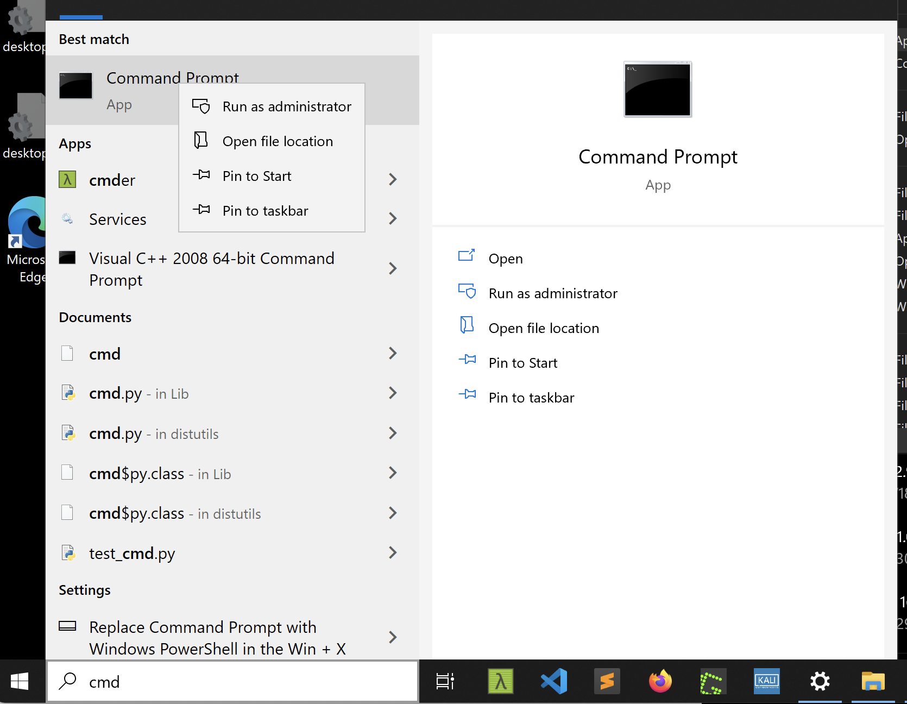

# Lab 1: Setting up your laptop

Walkthrough video:

**Docker and Bash 1-1** [https://www.youtube.com/watch?v=4vl4aUxo8Hk](https://www.youtube.com/watch?v=4vl4aUxo8Hk)

## Getting started

We will set up various software that will be used in the labs, with the main one being _**Docker Desktop**_. However, it is a good idea to create a folder specifically for organising the different week's labs.

## Windows users only: Installing Windows Subsystem for Linux (WSL)

This is a necessary step for the unit and also for running the Docker Desktop. There are instructions for this on the web e.g. here: [https://andrewlock.net/installing-docker-desktop-for-windows/](https://andrewlock.net/installing-docker-desktop-for-windows/)

To get started, you need to launch a command prompt in Administrator mode. Search for cmd and then right-click on the command prompt and select run as Administrator.



Then enter the following commands (2 separate lines):

> dism.exe /online /enable-feature /featurename:Microsoft-Windows-Subsystem-Linux /all /norestart
>
> dism.exe /online /enable-feature /featurename:VirtualMachinePlatform /all /norestart

Now type _powershell_ to get a powershell prompt and continue with the commands (two separate lines):

> Enable-WindowsOptionalFeature -Online -FeatureName VirtualMachinePlatform -NoRestart
>
> wsl --set-default-version 2

From the Windows Store, search for and install: Ubuntu 20.04

After this, restart windows.

To test this out, type wsl in the search bar and run the command prompt.


There are a number of things that can go wrong doing this installation. Some common problems and their solutions are listed below.

Problem 1: You can't find cmd.exe or PowerShell:

1. PowerShell can be installed from the Microsoft Store.
2. You may be running in Windows S mode that will prevent you running and installing apps - to deactivate this feature: To **turn off Windows** 10 **S Mode**, click the Start button then go to Settings > Update & Security > Activation. Select Go to the Store and click **Get** under the Switch **out of S Mode**

Problem 2: You encounter problems installing and running WSL 2

1. Follow the instructions here [https://docs.microsoft.com/en-us/windows/wsl/install-win10](https://docs.microsoft.com/en-us/windows/wsl/install-win10) the kernel update is the key thing
2. Please note, WSL 2 requires at least **Windows 10 version 1903**.

Problem 3: If Docker Desktop fails to start

1. Clean up data and try again


## Running Windows 10 on Azure

If you are unable to get your laptop/PC working, another option is to run Windows 10 on a Virtual Machine on Azure. To do this, you will need a student account created on https://portal.azure.com/.

You can create a VM using Windows 10 Pro 21 H1 and pick a Standard\_D2s\_V3 machine. Use all of the default settings but select Australia as the region to run it in (if you are located internationally, pick a region close to you).

Once created, you can connect to the machine via remote desktop and then configure the machine as above.


Although you have credit when creating a student account, be careful with the machine and stop it running by using the console when you are not using it - that way you will not be charged for the time you are not using it.


## Apple Mac M1 (Apple Silicon) Users: Enable Rosetta

Apple's computers are increasingly using the new M1 chip that uses a different instruction set than the Intel-based Macs. Apple allows programs built for the Intel chip to run by using an emulator called Rosetta 2. If you have not already installed it, then:

1. Open a Terminal window
2. Type (paste) the command `/usr/sbin/softwareupdate --install-rosetta --agree-to-license`

Once this is done, you can proceed with installing and running Docker Desktop (below).

Whilst all of the Docker images in the labs can be run on the Apple M1, there may be warnings given about the platform (you can avoid this warning by passing the argument --platform linux/amd64). We have created a multi-platform version for some images, which should be auto-selected when those images are used.

## Installing and running Docker Desktop

We will be using a technology called Docker Desktop to run different environments on your laptop. Unfortunately, this environment will not be available on the lab machines, so we will try and provide an alternative for people who want to use the lab machines.

You can get a more comprehensive overview of what Docker is from here [https://docs.docker.com/get-started/overview/](https://docs.docker.com/get-started/overview/). To summarise though, Docker allows you to "package and run an application in a loosely isolated environment called a container". Containers are a way of virtualizing an environment by using the native operating system's functionality to isolate application environments.

The process for installing Docker Desktop is straightforward and involves using the installer for the particular laptop you have:



### Installing Docker on Ubuntu (on your VM)

Follow instructions from here: [https://docs.docker.com/engine/install/ubuntu/](https://docs.docker.com/engine/install/ubuntu/)


To test the environment, we will run a simple container that allows you to access a bash terminal. This allows you to enter commands that get executed within the container. You can only do what the container will let you do as it is a constrained environment.

To start with, make sure that your Docker Desktop application is running. Once it is, open a terminal window, PowerShell or Command prompt and run the following commands (please note, the process may take a while on your machine).

```
PS C:\> docker pull uwacyber/cits1003-labs:bash
bash: Pulling from uwacyber/cits1003-labs
a31c7b29f4ad: Pull complete
56dc59d71033: Pull complete
2bfc36697d0c: Pull complete
9f3f7e1eed32: Pull complete
6f99373aa497: Pull complete
2bd679cc1668: Pull complete
312a9631755e: Pull complete
Digest: sha256:3aa1540adfa7a7bdd8e0955845e24372d2a7a28d5a9aa45f957abc9714a29aa2
Status: Downloaded newer image for uwacyber/cits1003-labs:bash
docker.io/uwacyber/cits1003-labs:bash
```

```
PS C:\> docker run -it --rm uwacyber/cits1003-labs:bash
root@9215e663eb9d:/# whoami
root
root@9215e663eb9d:/#
```


If you get a `permission denied` message, you should add `sudo` at the beginning of your command.


The `docker pull` command downloads the docker image to your machine. The image contains all of the files and configurations needed to run the container. You run a container using the `docker run` command as shown above.

In the case of the bash container, to stop it, you simply type `exit`. Other containers can be stopped using the `docker stop` command from another terminal. To do this, you need to provide the Container ID which you can do as follows:

```bash
0x4447734D4250:~$ docker ps -a
CONTAINER ID   IMAGE                         COMMAND       CREATED         STATUS         PORTS     NAMES
45fe3a838ef0   uwacyber/cits1003-labs:bash   "/bin/bash"   3 minutes ago   Up 3 minutes             hungry_hodgkin
0x4447734D4250:~$ docker stop 45fe3a838ef0
45fe3a838ef0
```

By simply quitting with command `exit`, it saves the container. If you wish to remove the container automatically when you finish the session, add the `--rm` flag:

```
PS C:\> docker run -it --rm uwacyber/cits1003-labs:bash
```

This will automatically remove the container so you don't have to go to GUI to do it (of course, nothing you do in this container will be saved).

If you saved the container and wants to restart that container that has stopped, first find the container ID you want to restart:

```
docker ps -a
```

Next, restart the container:

```
docker start -ai container_id
```

Here, the container ID is retrieved from the first column from the previous step (copy and paste).

Finally, once you have finished with a container, you can remove the container that was saved by:&#x20;

```
docker rm container_id
```

Remember that anything you have done in the container will be lost when you remove the container.&#x20;

You can also delete the image downloaded from the Docker Desktop GUI, or from the command line find the image ID (column `IMAGE ID`):

```
docker images
```

Delete the docker image:

```
docker rmi image_id
```

We will be using containers in the various labs and so you will learn more about using Docker and how containers work generally as we proceed.

### Question 1. Find your first flag

Go back to the bash docker container. There is a file called flag.txt hidden somewhere. Can you find it?



Click on the Hint tab to reveal the solution




To find the file, we will first go to the home directory of the user root by using the

> cd /root

command. This will change the current directory to /root

Once there, we can list the contents of that directory by using the **ls** command (don't worry about the meaning of "-al" flag for now)

> ls -al

There will be a file called flag.txt in the directory. We can view the contents of the file by using the **cat** command:

> cat flag.txt




**Flag: Submit the flag on the CTF server that you just found!**

## Case study: The World’s First Data Embassy

“Through its e-Estonia initiative, Estonia has built a digital society and developed the most technologically advanced government in the world. Practically every government service is paperless and performed electronically. As a result, Estonia is highly dependent on its information systems and the data stored on them. To protect its data, Estonia developed the concept of data embassies – servers outside the country that are legally under Estonian jurisdiction. The digital copies of key databases they store can be accessed in the event of a major data incident in the country, thereby protecting the digital lifeblood of this small Nordic country. Estonia is on its way to becoming a “country without borders”, and the data embassy is one of several Estonian programmes that blurs the lines of national borders and sovereign identity in a digital world.”

Read through the following article and answer the questions below: [https://www.oecd.org/gov/innovative-government/Estonia-case-study-UAE-report-2018.pdf](https://www.oecd.org/gov/innovative-government/Estonia-case-study-UAE-report-2018.pdf)

### Question 2. CIA

The ​​2007 wave of cyber attacks against Estonian government agencies, banks and media websites were in the form of Distributed Denial of Service (DDoS) attacks. These resulted in disruptions to the display of Estonian internet sites. This is primarily a violation of which aspect of cybersecurity?&#x20;

* Confidentiality&#x20;
* Integrity&#x20;
* Availability&#x20;
* Authentication&#x20;
* Accountability


Submit your flag with the correct answer (e.g., `CITS1003{Confidentiality}` if option 1 was the correct answer).


### Question 3. Authentication types

In Estonia, every citizen receives an electronic-ID in the form of an 11 digit personal identification number from the government. The ID is additionally issued with PIN codes enabling the person to use e-ID functionalities such as accessing state and private sector e-services. Primary electronic identification comes with a physical ID card, which is a mandatory identification document in Estonia. This form of identification can also be carried oute digitally, such as via mobile-ID. Additionally, during the application for obtaining this card, the applicant must be physically identified by Police and Border Guard officials at least once during the application process. Based on solely the above information, which type of authentication does this electronic-ID provide?&#x20;

* Type 1&#x20;
* Type 2&#x20;
* Type 3&#x20;
* Type 4


Submit your flag with the correct answer, replacing spaces with underscores (e.g., `CITS1003{Type_1}` if option 1 was the correct answer).


### Question 4. CIA returns

The article describes data centers in Estonia and Luxembourg and the associated challenges in keeping data in sync across them. One possible method could be providing object metadata by default for every object stored in the data center. This may include the entry date, content length, the last modified date and a hash of the content. Dissimilarities in metadata between data centers for the same object could help detect discrepancies. This measure would help maintain which aspect of cybersecurity?&#x20;

* Confidentiality&#x20;
* Integrity&#x20;
* Availability&#x20;
* Authorisation&#x20;
* Non-repudiation
