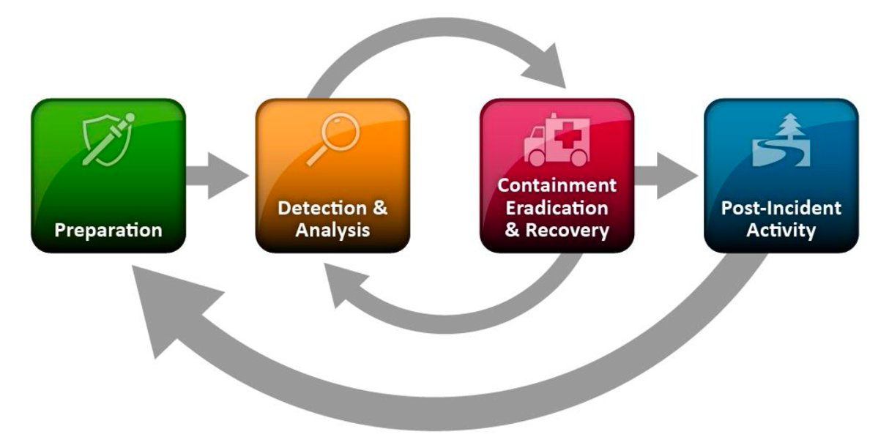

# Lab 7: Incidents

There are a number of specific definitions of a cybersecurity incident:

* Any event that has compromised confidentiality, integrity or availability of an organisation’s assets 
* From a VERIS perspective, an incident is the result of an Actor, taking some Action, on an Asset, resulting in the Attributes of an incident, i.e., how it was affected. In this case, the action exploits a vulnerability in the asset 
* An incident is when there is actual loss or imminent threat of loss. Otherwise, it is an Event 
* Standard for incident handling is NIST SP800-61 it defines an incident as: “A computer security incident is a violation or imminent threat of violation of computer security policies, acceptable use policies, or standard security practices”

What most organisations take this to mean in practice is that they have discovered unauthorised access or use of an organisations's assets. From a legal perspective, even accessing a machine without permission is potentially a crime. Of course, the cybersecurity incident becomes much worse if the access then leads to the theft or corruption of data.

An incident can be detected in a number of ways. The organisation may be alerted through the use of Intrusion Detection Systems/Intrusion Protection Systems \(IDS/IPS\) or through the use of a SIEM \(Security Information and Event Management\) system which is supplied with data from log files from network equipment and computers. An anti-malware software system might raise the alarm or a user may notice erratic behaviour on their computer. 

However, it is also possible that attacks go unnoticed for extended periods of time. The _**dwell time**_, the time between an attack and it becoming noticed, is globally around 24 days. Once the attack is noticed however, an incident management process is started and is handled through an incident response team.

## Handling an Incident



In this lab, we are going to concentrate on the detection and analysis part of the lifecycle. We are going to start with a range of observations that will give us potential indicators of compromise \(IOCs\) and techniques and procedures and we will eventually identify the specific group that carried out the attack. 

## Using Yara to identify Malware

Yara \([https://github.com/VirusTotal/yara](https://github.com/VirusTotal/yara)\) is a tools that uses a set of configurable rules to identify and classify malware. Of course, your antimalware software installed on desktops will try and identify any malware it finds and there are also online tools that will try and identify malware that is uploaded to them like [https://www.virustotal.com/gui/](https://www.virustotal.com/gui/). However, there are situations where malware is found, or machines and storage devices need to be searched to check if malware is present on them.

Yara tries to match text and binary from the malware it analyses. Before we start matching malware, let us try and write a rule that will match the text "hello, world!". 

To start, run the docker container:

```bash
docker run -it cybernemosyne/cits1003:incident
```

Change directory to /opt/malware/test. This directory has a subdirectory ./files which has two files in it. One called bye.txt which contains the text "bye bye" and another file called hello.txt that has the text "hello, world!"

We are going to create a Yara rules file which you can edit on the machine using the editor **vi**. If you haven't used vi before, don't worry, I will step you through the way to use it.

Start editing the file by typing 

```bash
vi hello_world.yar
```

To start editing, type **i** for insert mode. Then type the following rule:

```bash
rule hello_world
{
	strings:
	   $hello = "hello, world!"
	condition:
	   $hello
}
```

Once you have finished typing, hit the Escape key "esc" which puts you into command mode and then type **:wq** which will save the file and quit vi.

Before we run the rule, let us go through what it is actually doing. The variable $hello is set to the value of the text \(the string\) "hello, world!". The condition simply says check if that string is in the file and if it is, the condition is satisfied and Yara reports a match. Let us run yara with this rules file in the directory /opt/malware/test as follows:

```bash
root@30fc2c3b6def:/opt/malware/test# yara hello_world.yar ./files
hello_world ./files/hello.txt
```

We have run yara and told it to search the subdirectory ./files and it has found a match in the file hello.txt.

Of course, Yara rules can get much more complicated but the principle is the same. Once you have found a piece of malware, you can write rules that will match that malware because of the text and binary data it contains. You can also find malware that is related to the malware in some way because it has reused some code for example.

## Exercise: Recognising Malware Samples

WARNING: The malware you are analysing is real and so \*do not\* try and remove it from the container or run it. 

### Malware Sample 1

Change directory into /opt/malware/malware\_sample1and run yara using the rules file against the malware. It should identify it with a name. Once you have found out the name of the malware, investigate the web to find out the following about the malware:

1. What is the name of the malware?
2. What is the name of the group thought to be responsible for the malware?
3. Who are the usual victims of the group thought to be?

Hint: You should be able to find a document by Kaspersky giving you the answers to these questions. 

An interesting point about this group is that not very much information is provided about it by the US site MITRE ATT&CK which details tactics, techniques and procedures of attack groups. There is a little more information on this GitHub repository which is a Chinese cybersecurity company's view on things:

[https://github.com/RedDrip7/APT\_Digital\_Weapon/tree/master/Equation%20Group](https://github.com/RedDrip7/APT_Digital_Weapon/tree/master/Equation%20Group)

**FLAG: Get the MD5 hash of the file malware 1 and enter that in as a hash.** 


Actually, you could have just taken the hash of the file and done a Google search to find the name of the malware as it is in itself an IOC - but that doesn't work in the real world becuase the hash will change if a single byte is changed in the file and so it is very fragile.


### Malware Sample 2

Change directory into /opt/malware/malware\_sample1and run yara using the rules file against the malware. It should identify it with a name. Once you have found out the name of the malware, investigate the web to find out the following about the malware:

1. What is the name of the malware?
2. What is the name of the group thought to be responsible for the malware?
3. Who are the usual victims of the group thought to be?

With this malware, there is a long story related to it and we will cover this in the lectures on IoT, cyberphysical systems and critical infrastructure.

**FLAG: Get the MD5 hash of the file malware 2 and enter that in as a hash.** 

### Network log analysis

Malware often communicates with a command and control centre \(C2 server\) to send data and receive commands. The IP addresses and domain names used by malware are also IOCs. Of course, amongst IOCs, IP addresses and domains are relatively easy to change.

There is a \(small\) network log in the directory /opt/malware/malware\_conn.  The important bits of information from the log are the two IP addresses. The first IP address is the source IP address which in this case is a single machine. That is followed by a port number. The second IP address is the destination followed by the port that is being connected to. 

Examine the log and find any IP address that looks suspicious and check if indeed it is an IOC related to either of the two malware samples you have already identified. You should be able to:

1. Identify the IP address\(es\) that are associated with IOCs
2. Identify the malware that the IP address\(es\) belong to

**FLAG: Enter the malware name associated with the IP address\(es\)**


You can search through the file manually and see if you can spot anything but to make things easier you can use the following commands:

```bash
cat malware.log | awk -F ' ' '{print $3," ", $5, " ", $6}' | sort -u
```

The awk command will chunk each line based on text separated by spaces \(-F ' '\) and then print the source IP address, the destination IP address and the destination port. The sort -u command will sort the output and remove duplicates. 

The other thing to remember is that the address range 192.168. 0.0 to 192.168. 255.255 is non-routable across the Internet i.e. it is a private IP address range meant for internal networks.



